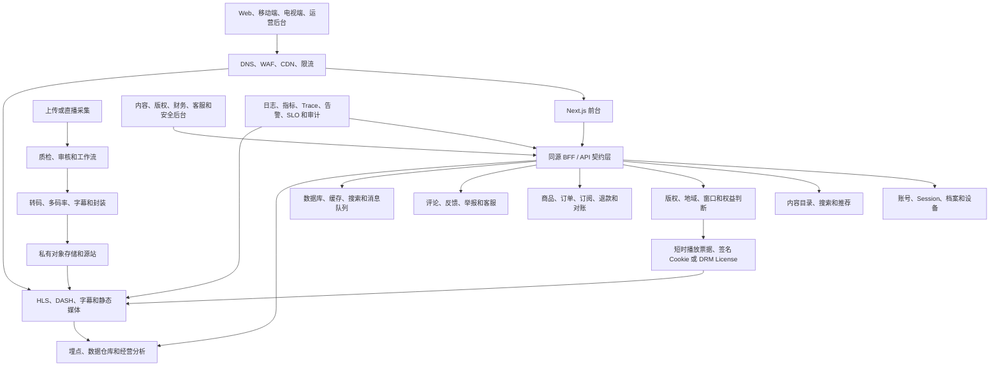

# 合格商用视频网站的完整能力与架构

最后核验：2026-07-30

文档状态：行业研究知识库

适用范围：商业视频产品立项、架构评审、能力盘点、上线门禁和 SquaredMedia 后续规划。

事实边界：

- 本文基于截至 2026-07-30 可公开获得的平台资料、技术标准和监管信息。
- Netflix、YouTube 等平台的内部系统没有完全公开，本文提炼的是可验证、可复用的架构原则，不是对其内部实现的完整复刻。
- 通用能力和当前 SquaredMedia 已实现能力分开描述；项目现状仍以代码、[项目总览](../../overview.md)、[当前项目深度总览](current-project-deep-dive.md)和模块文档为准。
- 法律、牌照、税务和应用商店部分不构成法律意见，应由实际经营地区的专业顾问最终确认。

## 结论

一个合格、可持续商用的视频网站，不是“MacCMS + 播放器 + VIP 页面”，而是一套能够同时闭环管理以下六类资产的业务系统：

1. 内容与版权。
2. 用户与播放权益。
3. 订单、支付与资金。
4. 视频资产与媒体交付。
5. 数据、增长与经营。
6. 安全、合规与生产风险。

任何一条没有闭环，都可能出现“功能能用，但不能商用”的情况。

## 一、成功案例分别证明了什么

| 平台           | 主要模式                       | 最值得借鉴的部分                                                     |
| -------------- | ------------------------------ | -------------------------------------------------------------------- |
| Netflix        | SVOD、广告套餐                 | 内容版权、家庭档案、个性化推荐、跨设备体验、全球 CDN、按内容优化编码 |
| Disney+ / Hulu | 品牌内容、订阅、广告、组合套餐 | 内容品牌入口、组合套餐、交叉推荐、不同价位覆盖                       |
| YouTube        | UGC、广告、会员、打赏、电商    | 创作者供给、搜索推荐、版权治理、收益结算、申诉机制                   |
| Twitch         | 直播、订阅、礼物、广告         | 直播主备链路、实时互动、社区治理、直播转 VOD/Clip                    |
| Vimeo OTT      | 白标 OTT、SVOD、TVOD、PPV      | 中小型商业视频平台的完整产品模板：CMS、支付、分析、应用、DRM         |
| 爱奇艺         | 长视频、会员、广告、IP         | 内容排期、会员收入、IP 生命周期和内容成本管理                        |
| Bilibili       | 社区、创作者、直播、广告、会员 | 社区文化、创作者生态、内容与用户关系                                 |
| 快手           | 短视频、直播、广告、电商       | 内容、达人、商品、支付和履约组成复合商业闭环                         |

Netflix 的公开材料强调内容、价格、体验和留存；其 Open Connect 把热门内容推到靠近用户的边缘节点，而推荐系统用于降低用户选片成本。

- [Netflix 2025 年报](https://s22.q4cdn.com/959853165/files/doc_financials/2025/ar/99482238-46b2-4d0d-b292-40e6781bdf03.pdf)
- [Netflix Open Connect](https://openconnect.netflix.com/Open-Connect-Overview.pdf)
- [Netflix 推荐说明](https://help.netflix.com/en/node/100639)
- [Netflix 按内容优化编码](https://netflixtechblog.com/per-title-encode-optimization-7e99442b62a2)

YouTube 证明，一旦允许用户上传，就必须同时承担创作者准入、版权识别、收益、审核和申诉，而不是只增加一个上传按钮。

- [YouTube 变现能力](https://support.google.com/youtube/answer/72857?hl=en)
- [YouTube Content ID](https://support.google.com/youtube/answer/2797370?hl=en)
- [YouTube 推荐系统](https://support.google.com/youtube/answer/16089387?hl=en)
- [YouTube Analytics](https://support.google.com/youtube/answer/9002587?hl=en)

Twitch 的公开架构展示了直播从采集、实时转码、多码率输出到 HLS/CDN 分发的完整链路，并把聊天、Clip、VOD 和社区治理视为直播产品的一部分。

- [Twitch 工程架构](https://blog.twitch.tv/en/2023/09/28/twitch-state-of-engineering-2023/)
- [Twitch 全球直播流采集](https://blog.twitch.tv/en/2022/04/26/ingesting-live-video-streams-at-global-scale/)

Vimeo OTT 对中小型项目尤其有参考意义：它把 SVOD、TVOD、PPV、内容管理、支付、分析、地域限制和 DRM 组合成面向品牌方的完整产品。

- [Vimeo OTT 能力与定价](https://vimeo.com/ott/pricing)
- [Vimeo OTT 销售模式](https://help.vimeo.com/hc/en-us/articles/12426980310417-Ways-to-sell-on-Vimeo-OTT)
- [Vimeo OTT 数据分析](https://help.vimeo.com/hc/en-us/articles/12427247662737-Types-of-data-analytics-provided-by-Vimeo-OTT)
- [Vimeo OTT DRM](https://help.vimeo.com/hc/en-us/articles/12427018635921-DRM-with-Vimeo-OTT)

中国平台进一步说明：精品内容和稳定排期会直接影响会员收入；社区和创作者模式会显著增加审核、结算与版权治理成本；直播和电商则需要商家、商品、履约和售后体系。

- [爱奇艺 2025 年度业绩](https://ir.iqiyi.com/news-releases/news-release-details/iqiyi-announces-fourth-quarter-and-fiscal-year-2025-financial)
- [Bilibili 投资者关系](https://ir.bilibili.com/)
- [快手 2025 年度业绩](https://ir.kuaishou.com/news-releases/news-release-details/kuaishou-technology-announces-fourth-quarter-and-full-year-2025/)

## 二、推荐的总体架构

下面是逻辑架构，不代表一开始就要拆成微服务。对当前项目，更合理的是“模块化后端 + BFF + 独立媒体流水线”，只有高负载或强隔离模块才逐步拆分。



这套架构最关键的原则是：

- 业务 API 和媒体交付分离。
- 前端展示和服务端授权分离。
- 用户权益和资金流水分离，但必须能够对账。
- 原始视频、转码产物和内容元数据分离。
- 版权可用性必须参与搜索、推荐、详情和播放授权，而不只是后台备注。
- 异步工作通过队列执行：转码、字幕、通知、支付补偿、索引更新、下架清理。
- BFF 负责稳定契约、聚合、字段裁剪和安全适配，不复制内容、订单和权限的业务真相。

## 三、商用项目应该包括的完整部分

### 1. 商业模型与产品定位

开发前必须形成一份明确的商业定义：

- 服务对象：大众、垂直兴趣、教育、体育、企业还是儿童。
- 内容来源：自制、采购、授权、合作方、创作者还是用户上传。
- 经营地区和允许访问地区。
- 核心终端：Web、移动 Web、App、电视端。
- 主变现模式：订阅、广告、单片购买、租赁、PPV、赞助或企业付费。
- 是否允许评论、弹幕、上传、直播、下载和投屏。
- 是否包含儿童或成人内容。
- 内容成本、CDN 成本、支付费率和客服成本。

至少要能计算：

```text
内容贡献利润
= 内容相关收入
- 版权或制作成本
- CDN 与流量成本
- 支付渠道费用
- 广告或创作者分成
- 审核与客服成本
```

早期不应同时建设所有商业模式。精品版权内容通常以 SVOD 为主；体育、演出和课程适合 TVOD/PPV；开放 UGC 才需要创作者分成和广告体系。

### 2. 内容 CMS 与版权中心

内容模型不能只是一张 `vod` 表。建议形成以下关系：

```text
节目
→ 季 / 集
→ 发行版本
→ 原始媒体资产
→ 转码版本
→ 音轨 / 字幕 / 海报
→ 版权窗口
→ 地域与终端可用性
→ 对应的商业权益
```

内容系统至少应支持：

- 电影、剧集、季、集、预告、花絮和直播回放。
- 标题、别名、简介、演职员、标签、分级、年份、地区和语言。
- 海报、横图、背景图、预告片和分享素材。
- 草稿、待审核、已通过、定时发布、下架和归档状态。
- 批量导入、重复内容识别和字段质量扫描。
- 编辑精选、专题、榜单、频道和运营位。
- 版本历史和管理员操作审计。
- 播放源健康检查和异常告警。

版权台账至少记录：

- 权利人、合同编号和证据文件。
- 允许地区、开始时间和到期时间。
- Web、App、电视等允许终端。
- SVOD、AVOD、TVOD、免费或 PPV 权利。
- 是否允许下载、投屏、剪辑和分享。
- 字幕、配音、音乐、海报和宣传素材权利。
- DRM、并发和清晰度要求。
- 到期后的搜索、推荐、缓存和 CDN 清理方式。

在播内容的权利台账覆盖率应为 100%，到期下架不能依靠人工记忆。

### 3. 视频资产与媒体流水线

标准点播链路应是：

```text
签名上传
→ 私有原片区
→ 文件探测和技术质检
→ 内容审核
→ 异步转码
→ HLS / DASH / CMAF 封装
→ 加密或 DRM
→ 私有源站
→ CDN
→ 播放授权
→ 多端播放器
→ QoE 数据
```

AWS 的公开 VOD 方案也采用对象存储、工作流编排、转码、HLS/DASH 输出和 CDN 分发的结构。[AWS Video on Demand](https://docs.aws.amazon.com/solutions/video-on-demand-on-aws/)

必备能力包括：

- 短时签名上传、分片、断点续传和校验和。
- 检测容器、视频轨、音轨、时长、分辨率、帧率和损坏文件。
- 原片不可变保存，转码结果可重新生成。
- 转码任务幂等、可重试，有失败队列和人工重跑。
- H.264/AAC 兼容基线，以及合理的 360p、540p、720p、1080p 多码率。
- 不把低清原片无意义放大为 1080p。
- HLS 主播放列表、多音轨和字幕轨；必要时同时提供 DASH/CMAF。
- 字幕采用 WebVTT 等标准格式，记录语言、默认、强制字幕和听障字幕。
- 视频切片采用较长缓存，manifest 和授权响应采用较短缓存。
- 原片和源站不可匿名访问。

Apple HLS、W3C MSE/EME 分别提供自适应流媒体、浏览器媒体缓冲和受保护内容播放的标准基础。

- [Apple HLS](https://developer.apple.com/streaming/)
- [Apple HLS Authoring Specification](https://developer.apple.com/documentation/http-live-streaming/hls-authoring-specification-for-apple-devices/)
- [W3C MSE](https://www.w3.org/TR/media-source-2/)
- [W3C EME](https://www.w3.org/TR/encrypted-media-2/)
- [DASH-IF Interoperability Guidelines](https://dashif.org/guidelines/iop-v5/)
- [W3C WebVTT](https://www.w3.org/TR/webvtt/all/)

DRM 不应默认覆盖所有内容。普通内容可以使用私有源站、短时票据、签名 Cookie 和防盗链；高价值版权内容再根据合同接入 Widevine、FairPlay、PlayReady，并考虑设备兼容、许可证服务和启动延迟。

- [Widevine](https://developers.google.com/widevine/drm/overview)
- [FairPlay Streaming](https://developer.apple.com/streaming/fps/)
- [CloudFront 签名 URL 与签名 Cookie](https://docs.aws.amazon.com/AmazonCloudFront/latest/DeveloperGuide/private-content-choosing-signed-urls-cookies.html)

### 4. 播放器和观看体验

播放器至少应具备：

- HLS 原生播放和 hls.js/MSE 回退。
- 自动和手动清晰度选择。
- 多音轨、字幕、倍速、全屏和画中画。
- 继续观看和跨设备进度同步。
- Seek、线路切换和错误恢复。
- 网络变化、后台恢复、弱网和断网提示。
- 播放失败原因分类：授权、媒体、网络、解码、DRM、字幕。
- 用户可理解的错误提示，而不是简单显示 `403` 或“播放失败”。
- 键盘、屏幕阅读器和移动端触控支持。
- 对外不暴露原始播放地址、签名密钥和内部错误。

播放器必须上传 QoE 数据，而不仅是页面访问量：

- 播放请求数和开始成功率。
- 首帧时间 p50/p95。
- 播放前退出率。
- 重缓冲次数和占比。
- 平均码率和清晰度切换。
- 致命播放错误率。
- 字幕和音轨加载失败率。
- 按浏览器、系统、设备、地区、ASN、CDN、影片和线路拆分。

参考：

- [Mux 播放启动时间指标](https://www.mux.com/docs/guides/data-startup-time-metric)
- [Mux 播放流畅度指标](https://www.mux.com/docs/guides/data-smoothness-metric)
- [Mux 监控指标](https://www.mux.com/docs/guides/monitoring-metrics)

### 5. 账号、档案、设备与权益中心

用户系统应包括：

- 注册、登录、找回、注销和账号冻结。
- 安全 Session、设备列表和远程撤销。
- 多用户档案和独立观看历史。
- 儿童档案、内容分级和家长 PIN。
- 收藏、历史、继续观看和观看偏好。
- 并发设备和并发播放限制。
- 账号共享风险识别，但避免仅凭 IP 误封移动用户。
- 用户数据导出、删除和隐私设置。

播放权益建议统一计算：

```text
账号 / 档案
+ 套餐或单片购买
+ 内容版权窗口
+ 地域
+ 设备
+ 并发状态
+ 内容密码或年龄限制
= 是否允许播放
```

判断结果由服务端产生短时播放票据。前端的“VIP 标识”和按钮状态不能成为授权依据。

Netflix 的档案、儿童模式和家庭设备机制可以作为产品边界参考：

- [Netflix 档案](https://help.netflix.com/en/node/10421)
- [Netflix Kids](https://help.netflix.com/en/node/114275)
- [Netflix Household 与设备识别](https://help.netflix.com/en/node/124925)

### 6. 搜索、发现与推荐

第一阶段不需要直接建设 Netflix 级机器学习系统。一个合格首发版本应该先有：

- 首页运营编排。
- 最新、热门、评分和继续观看。
- 分类、年份、地区、语言和标签筛选。
- 标题、别名、演员和关键词搜索。
- 搜索纠错、联想和无结果词统计。
- 相似内容、同系列和同演员内容。
- 明确的“不感兴趣”和负反馈。
- 推荐原因和用户关闭个性化选项。

YouTube 明确区分首页、下一个视频、搜索等不同场景，并综合观看、搜索、订阅、点赞、负反馈和满意度信号。

- [YouTube 推荐系统](https://support.google.com/youtube/answer/16089387?hl=en)
- [YouTube 搜索排序](https://support.google.com/youtube/answer/16090438?hl=en)

推荐建设顺序应为：

1. 编辑规则、热门、最新和继续观看。
2. 用户档案级个性化和相似内容。
3. 多目标推荐、长期满意度和实验平台。

### 7. 商品、订单、支付和订阅

付费项目不能只实现“充值成功后修改 VIP 时间”。

完整对象应包括：

- 商品、套餐、价格、币种、税费和优惠券。
- 订单、支付单、退款单和拒付单。
- 订阅、续费计划、试用期和宽限期。
- 权益发放、权益撤回、冻结和恢复。
- 渠道交易号、内部流水号和对账批次。
- 发票或税务状态。
- 财务与客服权限隔离。

订阅生命周期至少覆盖：

```text
试用
→ 首次支付
→ 生效
→ 自动续费
→ 续费失败
→ 宽限期
→ 恢复或到期
→ 取消
→ 退款或拒付
→ 权益回收
```

必须遵守：

- 只能根据服务端支付确认和有效回调发放权益。
- 回调必须验签、防重放、幂等，并支持乱序和重复投递。
- 浏览器跳转到“支付成功页”不能直接开通会员。
- 每日对账，差异进入人工处理队列。
- 订单、支付、权益和资金流水不能混为一张表。
- 优先使用托管收银台和 Tokenization，避免自己保存卡数据。
- 自有系统不得存储 CVV。

支付卡业务应按当前 [PCI DSS](https://www.pcisecuritystandards.org/document_library/?class=pcidss&doc=pci_dss) 范围评估。Apple、Google 的订阅和数字内容支付规则变化较快，有原生 App 时必须在每次发版前重新核验。

- [Apple App Review Guidelines](https://developer.apple.com/app-store/review/guidelines/)
- [Apple Auto-renewable Subscriptions](https://developer.apple.com/app-store/subscriptions/)
- [Google Play Payments Policy](https://support.google.com/googleplay/android-developer/answer/9858738)
- [Google Play Subscription Policy](https://support.google.com/googleplay/android-developer/answer/9900533)

### 8. 运营后台

一个商用后台至少应拆分责任，而不是所有人共享超级管理员：

- 内容编辑后台。
- 版权和地域窗口后台。
- 视频资产、转码和字幕后台。
- 首页、专题和推荐运营后台。
- 商品、订单、退款和对账后台。
- 用户、设备、会员和风控后台。
- 评论、举报、申诉和审核后台。
- 客服工单后台。
- 播放质量和线路健康后台。
- 系统配置、特性开关和发布后台。
- 审计日志和安全事件后台。

角色至少包括超级管理员、内容、版权、运营、审核、客服、财务和安全审计。退款、批量下架、权限提升和密钥修改等高风险动作应支持重新认证或双人复核。

### 9. BFF 与 API 契约层

BFF 的价值是让 React 不直接理解 MacCMS 内部数据结构：

- 聚合多个后端请求。
- 返回前端稳定、最小化的 DTO。
- 统一 Cookie、Session、CSRF、限流和错误码。
- 隐藏数据库字段、播放源和内部实现。
- 执行内容可见性和对象级授权。
- 统一缓存、超时、取消和重试策略。
- 为旧前端保留有限的兼容期。
- 让 MacCMS 升级不直接破坏 React。

但 BFF 不应自己发明一套用户、版权和订单真相。业务规则仍应由后端领域层负责。

API 文档应采用机器可读的 [OpenAPI](https://spec.openapis.org/oas/latest.html)，并声明：

- method 和路径。
- 登录、角色、CSRF 和权限要求。
- 请求与响应 Schema。
- 错误码。
- 幂等规则。
- 分页上限。
- 缓存语义。
- 示例。
- 版本和废弃周期。

### 10. 数据分析与经营系统

应建立统一事件规范，而不是每个页面随意埋点。

核心事件链：

```text
曝光
→ 点击
→ 详情
→ 播放请求
→ 授权
→ 首帧
→ 观看
→ 完播或退出
→ 收藏 / 购买
→ 续费或流失
```

指标至少包括：

| 领域 | 关键指标                                   |
| ---- | ------------------------------------------ |
| 用户 | 新增、活跃、留存、召回、档案使用率         |
| 增长 | 注册率、首播率、试看转化、付费转化         |
| 订阅 | MRR、ARPU、续费率、流失率、LTV             |
| 内容 | 曝光、开播、完播、观看时长、拉新和留存贡献 |
| 搜索 | 搜索量、点击率、无结果率、改写率           |
| 媒体 | 首帧、重缓冲、致命错误、平均码率           |
| 商业 | 支付成功率、退款、拒付、对账差异           |
| 成本 | 内容成本、转码、存储、CDN、每小时观看成本  |

日志和埋点不能记录 Cookie、密码、支付数据、完整签名媒体 URL 或不必要的直接身份信息。

### 11. 安全、隐私、版权和合规

安全基线建议组合使用：

- 企业风险治理：[NIST CSF 2.0](https://www.nist.gov/cyberframework)
- 安全开发：[NIST SSDF](https://csrc.nist.gov/pubs/sp/800/218/final)
- Web 应用验收：[OWASP ASVS](https://owasp.org/www-project-application-security-verification-standard/)
- API 风险：[OWASP API Security Top 10](https://owasp.org/API-Security/)

P0 控制包括：

- 管理员 MFA、RBAC 和独立账号。
- 安全 Cookie、Session 轮换和立即撤销。
- BOLA/BFLA 越权测试。
- 登录、注册、验证码、搜索、播放和兑换码限流。
- SSRF 防护：限制远程海报、字幕、采集源和媒体探测访问的协议、域名、IP、跳转和大小。
- 支付与播放回调签名、防重放和幂等。
- 密钥集中管理和轮换。
- 生产日志、仓库和构建产物中明文密钥数量为零。
- 上线时 Critical/High 已知漏洞为零。

隐私系统应记录每种数据的用途、依据、保留期限、存储地区、共享方、访问角色、删除路径和跨境情况。观看历史默认不得公开，注销删除应覆盖主库、缓存、索引、推荐特征和供应商。

国际业务需评估：

- [欧盟 GDPR 原则](https://commission.europa.eu/law/law-topic/data-protection/rules-business-and-organisations/principles-gdpr_en)
- [加州 CCPA/CPRA](https://oag.ca.gov/privacy/ccpa)
- [美国 Video Privacy Protection Act](https://uscode.house.gov/view.xhtml?edition=2023&num=0&req=granuleid%3AUSC-2023-title18-section2710)

中国业务应以[《中华人民共和国个人信息保护法》](https://www.npc.gov.cn/npc/c2/c30834/202108/t20210820_313088.html)为基础建立数据处理规则。

如果允许 UGC，需要版权投诉、反通知、重复侵权者政策、证据保全和人工申诉。美国市场可进一步评估 [DMCA](https://www.copyright.gov/dmca/) 安全港适用条件。

中国大陆公众视频服务还应尽早确认 ICP、视听许可或备案、内容生产和算法推荐等适用条件。

- [国家广电总局《互联网视听节目服务管理规定》](https://www.nrta.gov.cn/art/2007/12/29/art_1588_43750.html)
- [国家网信办《互联网信息服务算法推荐管理规定》](https://www.cac.gov.cn/2022-01/04/c_1642894606364259.htm)

这些事项可能是商业上线阻断项，不能在开发完成后才处理。

### 12. 未成年人和无障碍

儿童或可能被儿童使用的服务需要：

- 年龄适配和内容分级。
- 儿童档案和家长 PIN。
- 高隐私默认。
- 关闭公开资料、陌生人互动和行为广告。
- 家长同意、撤回和删除能力。
- 受限内容不能通过搜索、推荐、深链或直接媒体 URL 绕过。
- 未成年人举报优先处理。

参考：

- [美国 COPPA](https://www.ftc.gov/business-guidance/resources/complying-coppa-frequently-asked-questions)
- [中国《未成年人网络保护条例》](https://www.moe.gov.cn/jyb_xxgk/moe_1777/moe_1778/202310/t20231025_1087333.html)

无障碍目标建议采用 [WCAG 2.2 AA](https://www.w3.org/TR/WCAG22/)：

- 全键盘操作和清晰焦点。
- 屏幕阅读器可识别播放器控件和状态。
- 预录视频同步字幕。
- 直播业务提供直播字幕。
- 重要视觉信息提供音频描述或等效替代。
- 登录、支付、播放、取消订阅和隐私请求可以使用辅助技术完成。

### 13. 可观测性、发布和灾难恢复

生产监控应覆盖整条链路：

```text
页面
→ Session
→ API
→ 权益判断
→ 播放票据
→ Manifest
→ DRM
→ 首帧
→ 连续播放
→ 进度保存
```

建议起始目标如下。这些是工程起点，不是法律或行业硬标准：

| 指标               |            建议起始目标 |
| ------------------ | ----------------------: |
| 核心 API 月可用率  |                  ≥99.9% |
| 播放开始成功率     |                  ≥99.5% |
| VOD 首帧 p50 / p95 |           <2 秒 / <5 秒 |
| 重缓冲占播放时长   |                     <1% |
| 致命播放错误率     |                   <0.5% |
| LCP 75 分位        |                 ≤2.5 秒 |
| INP 75 分位        |                  ≤200ms |
| CLS 75 分位        |                    ≤0.1 |
| 版权到期自动下架   |                    100% |
| 支付差异           | 100% 对账或进入差异队列 |

Core Web Vitals 阈值来自 Google 当前定义；服务可用性应按真实用户行为定义 SLI/SLO，并通过 Error Budget 控制发布节奏。

- [Core Web Vitals](https://web.dev/articles/defining-core-web-vitals-thresholds)
- [Google SRE Service Level Objectives](https://sre.google/sre-book/service-level-objectives/)

工程体系还应包括：

- 开发、测试、预发布和生产环境隔离。
- 不可变发布包、Git SHA、依赖锁定和数据库迁移版本。
- 灰度、健康检查和快速回滚。
- 登录、支付、播放、CDN 和下架独立 Runbook。
- 数据库全量、增量和时间点恢复。
- 至少一份隔离或不可变备份。
- 定期真实恢复演练；CDN 不能当作备份。
- 无责事故复盘和行动项跟踪。

参考：

- [NIST SP 800-61 Rev.3](https://csrc.nist.gov/pubs/sp/800/61/r3/final)
- [Google SRE Postmortem Culture](https://sre.google/sre-book/postmortem-culture/)
- [CISA StopRansomware Guide](https://www.cisa.gov/stopransomware/ransomware-guide)

### 14. 测试和正式上线门禁

测试矩阵至少覆盖：

- 游客、普通会员、VIP 和单片购买用户。
- 试看结束、VIP 过期、退款和封禁。
- 地区限制、版权到期和密码内容。
- 设备撤销、并发限制和篡改内容 ID/线路/分集。
- 支付重复、乱序、伪造和超时回调。
- Chrome、Safari、Firefox、Edge、iOS 和 Android。
- 弱网、断网、Wi-Fi/蜂窝切换和后台恢复。
- 字幕、多音轨、Seek、倍速、全屏和清晰度切换。
- 后台上架、定时下架、审计和回滚。
- 隐私导出、注销和删除。
- 键盘、VoiceOver、NVDA 和 TalkBack。
- CDN、缓存、数据库和支付服务部分故障。
- 备份恢复和生产回滚演练。

发布门禁应包括编译、Lint、类型检查、单元测试、契约测试、关键 E2E、安全扫描、配置检查、数据库迁移检查和真实媒体播放验收。

## 四、按业务模式增加的模块

| 场景       | 需要额外增加                                                          |
| ---------- | --------------------------------------------------------------------- |
| 广告 AVOD  | 广告库存、VAST/VMAP、频控、品牌安全、同意管理、广告对账、播放故障隔离 |
| UGC/创作者 | 上传、创作者审核、频道、收益分成、版权申诉、内容治理、税务结算        |
| 直播       | RTMPS/SRT、主备推流、实时转码、聊天审核、录制、DVR、应急下线          |
| 原生 App   | 应用商店支付、服务端收据验证、离线下载、DRM、投屏、推送               |
| 电商       | 商品、库存、物流、售后、商户和达人结算                                |
| B2B 视频   | 租户、SSO、私有内容库、席位和配额、企业账单、域名白标                 |
| 成人内容   | 更严格的年龄验证、地域规则、支付限制和平台上架限制                    |

如果当前项目没有明确商业必要，不建议首发就建设 UGC、直播、广告竞价、全平台 DRM、多 CDN 和机器学习推荐。

## 五、项目必须配套的文档和组织

### 文档体系

- 产品：商业模式、用户、套餐、权益、流程和异常状态。
- 架构：系统架构图、数据流图、部署图和威胁模型。
- 内容：内容模型、版权台账和上下架规则。
- 设计：Figma 页面、组件、Token、状态、响应式、动效和无障碍规范。
- API：OpenAPI、鉴权、错误码、幂等、版本和变更日志。
- 数据：埋点字典、指标口径、数据保留与删除。
- 测试：功能、播放、支付、安全、无障碍和设备矩阵。
- 运维：SLO、仪表盘、告警、Runbook、部署、回滚和灾备。
- 合规：隐私、Cookie、版权投诉、未成年人、内容规则和供应商清单。
- 决策：ADR，记录为什么选择某个播放器、存储、CDN、支付和 DRM。

### 责任人

小团队可以一人兼任，但不能没有责任：

- 产品和商业负责人。
- 技术负责人。
- 内容和版权负责人。
- 支付与对账负责人。
- 安全与隐私负责人。
- 内容审核和未成年人保护负责人。
- 运维值班与事故指挥负责人。
- 客服与申诉负责人。
- 无障碍负责人。

## 六、结合当前 SquaredMedia 项目的判断

以下只描述当前仓库可验证的边界，不替代生产环境验收。

当前仓库已经具备一部分良好基础：

- MacCMS 继续承担后台、数据、Session 和原生播放授权；Next.js 负责新前台，详见[项目总览](../../overview.md)。
- `pingfangapi` 已经是面向 React 的同源、白名单化生产 BFF，而本地 `react-api.php` 没有混入生产，详见[生产 API](../../pingfangapi.md)。
- 播放接口不直接暴露原始播放地址，并通过同源 stream 在媒体跳转前再次授权。
- 已有测试、独立 staging、候选进程验证、原子切换和回滚链路，详见[开发、发布与运维](../../development-and-operations.md)。
- 仓库明确不包含完整 MacCMS 核心、生产数据库和服务器运行时，因此仅凭当前源码不能确认资金、版权、媒体源站及生产合规已经闭环。

下一阶段不应先大规模重构前端，而应按以下顺序补齐或核实。

### P0：商业上线前

1. 明确商业模式、经营地区、内容来源和牌照结论。
2. 建立版权、地域、窗口、终端和商业模式台账。
3. 如果收费，建立订单、支付、退款、对账和权益状态机。
4. 核实媒体是否拥有私有源站、ABR 转码、CDN 和源站访问控制。
5. 把现有播放授权扩展为完整的免费、VIP、单片付费、到期、退款、设备撤销和版权下架矩阵。
6. 增加播放 QoE、API SLO、支付和下架传播监控。
7. 完成后台 MFA、RBAC、审计、密钥和 SSRF 检查。
8. 建立隐私、注销删除、版权投诉、字幕和无障碍流程。
9. 对生产数据库、媒体文件和配置执行真实恢复演练。
10. 使用真实 MacCMS、真实账号、真实媒体和真实 CDN 做商用验收。

### P1：稳定经营

1. 将 BFF 契约整理为 OpenAPI。
2. 建立统一事件字典和经营仪表盘。
3. 建立版权到期自动化和内容价值分析。
4. 建立设计系统、页面状态矩阵和无障碍验收。
5. 建立客服、退款、举报和申诉后台。
6. 建立 SLO、告警、Runbook、事故复盘和变更审计。
7. 根据实际用户行为完善搜索和规则推荐。

### P2：规模化后

- 多 DRM、取证水印、反共享和多 CDN。
- 机器学习推荐和实验平台。
- 原生 App、电视端和离线下载。
- 广告平台、UGC、直播和创作者结算。
- 多地区部署、国际税务和全球版权编排。

## 七、商用验收的最终判断

商用标准可以浓缩为一句话：

> 内容来源合法，用户权益可信，资金账目可对，视频播放稳定，用户数据受保护，发生故障或投诉时能够追踪、处置和恢复。

对 SquaredMedia 而言，当前已经拥有前台、MacCMS 后端边界、BFF、播放授权和发布回滚的良好基础；离“可商用完整体”最值得优先投入的不是更多页面，而是版权、支付权益、媒体资产、QoE、合规和生产治理这六个闭环。
