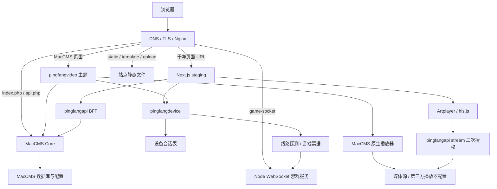

# SquaredMedia 当前项目深度总览

最后核验：2026-07-30

文档状态：当前项目知识库

本文基于当前工作区代码、配置、测试和模块文档，回答“这个项目现在是什么、各部分如何协作、哪些能力已经进入代码、哪些只是预览或制品、哪些仍未被生产证明”。它不是线上运行报告；分支与未提交状态见 [2026-07-30 工作区快照](../notes/current-worktree-2026-07-30.md)。

## 一、先给结论

SquaredMedia 当前不是一套从零自研的视频 SaaS，也不是单纯的 MacCMS 皮肤。它是围绕 MacCMS V10 构建的双前台、同源 BFF 和配套工程体系：

- MacCMS 是后台、内容与用户数据、Session、权限规则和原生播放授权边界。
- `template/pingfangvideo` 是可部署的 MacCMS 生产主题。
- `apps/web` 是独立的 Next.js App Router staging 前台，目标是逐步接管公开页面与交互。
- `pingfangapi` 把 MacCMS 能力裁剪成 React 可用的稳定同源契约。
- `pingfangdevice` 增强设备会话、筛选、线路抽样和联机游戏票据。
- 独立 Artplayer/HLS 播放器、联机游戏服务、质量扫描插件、预览工具、Figma 基线和发布脚本各自有明确边界。

当前项目已经具备私人/家庭视频收藏站所需的较完整浏览、账号、播放和工程基座，但还不是完整商用视频平台。订单支付、订阅、版权台账、DRM、媒体资产流水线、客户端 QoE、全量合规和生产经营系统不在当前闭环中。

## 二、如何判断“当前事实”

按以下优先级阅读：

1. 当前工作区代码、配置、脚本和测试。
2. `docs/overview.md` 与顶层模块文档。
3. 本知识库中的当前项目总览与带日期工作区快照。
4. `docs/superpowers/**` 中的历史计划、设计和交接记录。
5. 外部行业参考。

还必须区分五种证据状态：

| 状态                   | 含义                                                               |
| ---------------------- | ------------------------------------------------------------------ |
| 生产路径已实现         | 代码会进入生产主题、插件或服务发布链，但不自动代表某台服务器已部署 |
| Staging 路径已实现     | 代码进入独立 Next staging 链，不代表主站已经切流                   |
| 已有但需显式安装       | 能生成制品，但现有常规部署不会启用                                 |
| 仅本地预览             | fixture、静态或 PHP 模拟，只能验证有限页面流程                     |
| 依赖外部配置或尚未验证 | 仓库缺少运行环境、真实数据或验收证据                               |

“测试通过”“路由返回 200”“部署脚本存在”和“线上已验收”是四件不同的事。

## 三、模块地图

| 模块                              | 当前职责                                                           | 状态               | 主要边界                                                 |
| --------------------------------- | ------------------------------------------------------------------ | ------------------ | -------------------------------------------------------- |
| `template/pingfangvideo/`         | 84 个 MacCMS 模板、五套主题、共享交互和原生播放承载                | 生产路径已实现     | 依赖完整 MacCMS runtime、标签和后台播放器配置            |
| `apps/web/`                       | 32 个 App Router 页面、React UI、同源 API、Artplayer/HLS、游戏入口 | Staging 路径已实现 | 当前目标固定为 `www.ping2.my`；内容不是完整 SSR          |
| `addons/pingfangapi/`             | 28 个 JSON action、播放页和二次授权 stream                         | 生产路径已实现     | BFF，不是第三方开放 API；真实权限矩阵仍需验收            |
| `addons/pingfangdevice/`          | 设备 Session、筛选、线路抽样、游戏票据                             | 生产路径已实现     | 部分 action 的 CSRF/Origin 保障未在仓库内独立证明        |
| `addons/videolint/`               | 后台视频质量扫描、问题记录和 CSV 导出                              | 已有但需显式安装   | 不在 CI 制品/自动部署；鉴权、CSRF 和远程 URL 安全需再审  |
| `maccms-player/`                  | 独立 Artplayer/HLS 性能版                                          | 已有但需显式安装   | 不负责登录/授权，不由常规部署安装                        |
| `services/game-server/`           | 五子棋、你画我猜的服务端权威规则与内存房间                         | 生产路径已实现     | 单进程内存状态，不能直接水平扩容                         |
| `preview/`、`server/`、`docker/`  | 静态/PHP/容器 fixture 预览                                         | 仅本地预览         | 不含 MacCMS Core/DB，不能证明生产权限与播放              |
| `scripts/`、`ops/`、`.github/`    | 验证、打包、发布、回滚、Nginx/systemd 和数据维护                   | 工程支撑           | 脚本测试不等于真实 SSH/systemd/Nginx/DB 恢复             |
| `scripts/figma-product-baseline/` | 受保护 Raw Evidence 和代码对齐设计基线                             | 本地设计工具       | 当前 source roots 仍以旧 MacCMS 基线为主，未覆盖现 React |

## 四、整体运行架构



这仍是模块化单体加少量独立服务，不需要为了“规范化”立即拆成大量微服务。最重要的是守住契约和权限边界：

- 浏览器不直接连接数据库。
- 列表和详情不暴露原始播放源。
- 页面展示状态不替代服务端授权。
- BFF 不复制 MacCMS 的数据真相。
- 游戏和播放器的临时票据不扩大为永久凭证。
- 本地 fixture 不进入生产主题或被描述为生产 API。

## 五、路由所有权

当前 staging Nginx 的设计意图是：

| 路径族                                                                        | 所有者               | 说明                              |
| ----------------------------------------------------------------------------- | -------------------- | --------------------------------- |
| `/`、`/videos`、`/vod/**`、`/watch/**`、`/account/**`、`/games/**` 等干净 URL | Next.js              | App Router 页面                   |
| `/index.php/pingfangapi/index?action=*`                                       | MacCMS/PHP           | React 生产 BFF                    |
| `/index.php/pingfangapi/player`、`stream`                                     | MacCMS/PHP           | 原生兼容播放页与二次媒体授权      |
| `/api/native-playback-*`                                                      | Next.js Node runtime | 固定 staging 域名的临时原生播放桥 |
| `/game-socket`                                                                | Node 游戏服务        | Nginx 同源 WebSocket 反代         |
| `/index.php`、`/api.php`                                                      | MacCMS/PHP           | 保留后台与原生接口                |
| `/static`、`/template`、`/upload`                                             | MacCMS 站点文件      | 不经过 Next                       |
| `/react-api.php`、`/preview`                                                  | staging 404          | 防止本地 fixture 暴露到生产入口   |

旧播放地址和五个旧游戏 label 的 GET/HEAD 会先经过受限的单跳迁移规则；其他 PHP 请求仍保留给 MacCMS。`src/proxy.ts` 能证明 Next 侧规则，但生产所有权最终要以实际 Nginx 配置和请求验收为准。

## 六、核心业务链

### 1. 内容发现

```text
页面请求
→ AppShell 确认 Session
→ navigation 或 home_v2
→ content / detail 按需请求
→ Zod 校验
→ React Query 缓存与页面状态
```

生产 BFF 复用 MacCMS `Vod`、`Type` 和公共配置，完成：

- 首页 hero、年度榜、最新和频道区块聚合。
- 目录分页、筛选、搜索和精确总数。
- 详情、相关内容、剧情和下载入口。
- 用户组可见性和字段白名单。
- 首页 300 秒级缓存、统计摘要 1800 秒级缓存。

当前首页频道 ID 固定为 `42,47,48,57,111`。这适合现站点，不是可移植的自动栏目发现机制。

### 2. 账号与私有数据

```text
MacCMS 原生登录
→ pingfangapi / pingfangdevice 适配
→ PHP Session 与设备 Cookie
→ 收藏/历史 Ulog
→ DeviceSession 设备列表与撤销
```

已进入代码的能力：

- 既有会员登录与退出。
- Session、CSRF、验证码要求的最小 DTO。
- 收藏状态、分页收藏、批量删除。
- 分页历史、进度保存、批量删除。
- 设备列表与远程撤销。
- 评论、留言、片源报错、顶踩和评分。

注册、注册验证码和找回账号是明确退场能力，对应 action/旧页面返回 `404/410`，不应误标为遗漏。

匿名历史只在浏览器；登录历史写入 Ulog。防止旧进度覆盖新进度的 checkpoint 水位当前仍在 PHP Session 中，因此不能描述为跨设备全局一致。

### 3. 播放

项目同时存在三条不同播放链：

| 播放链                                        | 当前定位        | 授权边界                                     |
| --------------------------------------------- | --------------- | -------------------------------------------- |
| MacCMS 主题 `{$player_data}` / `{$player_js}` | 生产主题默认链  | MacCMS 原生权限与后台播放器配置              |
| React Artplayer/HLS                           | Next staging 链 | `access`、`playback` 与 `stream` 二次校验    |
| `maccms-player` 独立归档                      | 可选性能版制品  | 只消费已授权 URL，本身不做登录或 entitlement |

React 列表和详情不返回原始 `vod_play_url`。MacCMS cache 可用且写入回读成功时，BFF 生成 120 秒、影片/线路/分集/媒体绑定的 256 位随机票据，`stream` 再校验并返回不可缓存 `302`；cache 不可用时回退到无票据同源路径，由 `stream` 重新按当前 Session 鉴权。

当前边界：

- 客户端计时试看不是安全授权；React 的安全试看尚未闭环。
- `ps=1` 第三方解析线路不受当前非 iframe React 播放链支持。
- 确认购买页没有真实订单、扣点或支付 action。
- 独立播放器不由常规部署自动安装。
- 线路健康抽样是服务器视角，不是客户端 QoE。

### 4. 线路质量

`VodSourceQuality` 对最多 12 条线路做有界服务器抽样，包含：

- HTTP(S) 白名单和凭证拒绝。
- localhost、私网和保留 IP 拒绝。
- DNS 解析后固定地址，降低重绑定风险。
- 总时长、单请求、重定向和响应字节预算。
- 脱敏健康、清晰度和排序结果，不返回媒体 URL 或 parser token。

它可辅助选线，但不能回答用户设备的首帧、重缓冲、解码兼容、运营商或 CDN 质量。仓库当前没有完整客户端 QoE 上报管道。

### 5. 联机游戏

```text
登录会员
→ pingfangdevice 签发 60 秒 HMAC 票据
→ 浏览器连接同源 /game-socket
→ Node 验证 Origin、票据、client_id 和 jti
→ 服务端控制房间、轮次与胜负
```

五子棋落子、你画我猜画手权限和答案隔离由服务端控制。消息大小、频率、人数、笔画和重连均有上限。

房间、已用票据、画作和战局只在单进程内存中；重启会丢失，当前没有共享状态、战绩、聊天归档或排行榜。

### 6. 视频库质量与数据维护

- `videolint` 扫描标题、海报、分类、地区、年份、简介、播放源、状态和重复内容，只记录问题，不直接修正 `mac_vod`。
- 分类维护 SQL 只修正已知父子分类关系，不根据片名猜分类。
- 海报修复默认 dry-run，要求确定性匹配、全新 JSONL 报告、备份表和并发旧值比较。

`videolint` 当前不在自动发布中，也没有专门测试。其 CSV 导出鉴权、公式注入、CSRF 和远程海报检查的 TLS/SSRF 边界需要在安装前再审。

分类维护 SQL 的注释提到结果不符时可回滚，但当前文件末尾会无条件 `COMMIT`；把文件直接重定向给 MySQL 时没有人工观察后再选择回滚的窗口。执行前仍需数据库备份，并按[分类维护手册](../../maccms-vod-category-maintenance.md)和运维文档确认实际事务步骤。

## 七、API 与安全边界

### BFF 的作用

`pingfangapi` 不是把 MacCMS `/api.php` 再代理一遍。它在同一 PHP 进程里复用模型、配置和公共函数，然后：

- 聚合首页和页面所需数据。
- 裁剪字段并用统一 JSON envelope 返回。
- 把用户组、密码、版权和播放授权放进页面契约。
- 统一同源 POST、CSRF、限流和错误码。
- 隔离原始播放/下载地址。
- 为旧版本保留向后兼容响应。

当前生产逻辑面有 30 个入口：28 个会强制 Method 的 JSON action，加 `player` 和 `stream` 两个典型 GET、但控制器尚未设置 Method gate 的路由。MacCMS 原生 OpenAPI 的完整统计和逐能力映射见 [生产 API](../../pingfangapi.md#142-maccms-原生接口与生产-reactapi-统计)。

### 已实现的主要控制

- React API 基址必须同源。
- 所有 BFF POST 经过同源、CSRF 和 action 级限流。
- JSON 请求体、字段和枚举有显式边界。
- 设备 token 使用随机值、哈希存储和 HttpOnly Cookie。
- 播放与游戏使用短期、对象绑定的票据。
- 列表和详情不携带媒体源。
- 线路探测有显式 SSRF 防护和资源预算。
- 部署包、备份 ID、release ID 和输入指纹有多层校验。

### 尚未证明或需要修复的边界

- `pingfangdevice` action 未在自身代码中显示统一 CSRF/Origin 校验；是否由 MacCMS 全局层提供，仓库没有完整证据。
- `videolint` 管理 action 和 CSV 导出需要独立鉴权、CSRF、公式注入和远程 URL 安全复核。
- 设备表保存 IP 与 User-Agent，应纳入访问控制、保留期限和隐私治理。
- `favorite.status` 的控制器日志白名单遗漏，错误日志会把该 action 归为 `unknown`。
- 高价值内容仍缺 DRM/license、设备并发播放和版权台账闭环。
- `ops/security/gptbot-ip-rules.json` 只是静态规则数据；仓库没有自动同步或应用脚本，不能描述为已启用的防火墙控制。

## 八、数据与状态归属

| 数据/状态                          | 当前存储                                                | 生命周期与边界                                       |
| ---------------------------------- | ------------------------------------------------------- | ---------------------------------------------------- |
| 内容、分类、用户、Ulog、评论、留言 | MacCMS 数据库                                           | 外部于本仓库；真实 schema/数据需服务器验证           |
| 设备 Session                       | `pingfang_device_session`                               | 持久化 token hash、UA/IP 和撤销状态                  |
| 视频质量扫描                       | `pingfang_video_lint_scan`、`pingfang_video_lint_issue` | 仅 `videolint` 安装后存在                            |
| BFF 内容缓存                       | MacCMS cache                                            | 默认 300 秒；摘要默认 1800 秒                        |
| 播放 ticket                        | MacCMS cache                                            | cache 正常时生成，默认 120 秒；否则走 Session 兼容链 |
| React staging 原生 ticket          | 单 Node 进程 Map                                        | 120 秒、最多 5000；重启丢失                          |
| 登录进度 checkpoint 水位           | PHP Session                                             | 防同会话旧写；不是跨设备共享水位                     |
| 匿名历史                           | 浏览器存储                                              | 本机浏览器，经过结构校验                             |
| 线路偏好/已尝试线路                | 浏览器/标签页                                           | 短期状态，不是服务端画像                             |
| 游戏房间和 jti                     | 单 Node 进程内存                                        | 重启丢失，不能直接多实例                             |
| Figma Raw Evidence                 | Figma 文件                                              | 只读保护；不是运行时数据                             |

## 九、设计、文档和实现的关系

当前设计基准强调“源码为事实源、Raw Evidence 只读、缺失状态只记录不补画”。这一原则仍正确，但当前工具计划绑定 `master@303e3b5 + working tree`，source roots 不含 `apps/web`，批准短语和校验器也绑定旧快照。

因此：

- 可以继续把现有 Figma 作为 MacCMS 主题与历史证据。
- 不能宣称它已经覆盖当前 React 页面、组件和状态。
- 更新前应先扩展 source roots、路由/组件映射、状态契约和验证器，再进行任何写入。
- 不应重绘或覆盖 Raw Evidence 来制造“已覆盖”的结果。

## 十、构建、制品、部署与回滚

### 发布单元

默认 `npm run package` 生成五个归档：

1. MacCMS 主题 `pingfangvideo`。
2. 设备插件 `pingfangdevice`。
3. 生产 BFF `pingfangapi`。
4. 独立播放器。
5. 联机游戏服务。

Next standalone 是第六条独立发布链，不混入上述归档。`videolint` 不在自动制品中。

### 两条发布链

| 发布链        | 命令                 | 会修改                                                   | 不会修改                                |
| ------------- | -------------------- | -------------------------------------------------------- | --------------------------------------- |
| MacCMS + 游戏 | `npm run deploy`     | 主题、两个插件、控制器/hook/设备表、游戏服务和相关 Nginx | 独立播放器、Next staging、`videolint`   |
| Next staging  | `npm run deploy:web` | Next release、systemd、staging Nginx include             | 主站主题、MacCMS 数据库、插件和游戏服务 |

`npm run deploy` 的 MacCMS 文件事务和游戏阶段不是同一个事务。游戏失败会恢复游戏阶段，但不会自动回滚已经提交的主题与插件。

`DEPLOY_SCOPE=backend` 或 `api` 只约束 MacCMS 打包/安装 scope；根 `deploy` 命令后仍会进入游戏部署阶段。若只想改 API 且完全不触碰游戏，不能只凭 scope 名称推断，必须选择并核对实际脚本链。

当前 staging Nginx 样例硬编码 `/tmp/php-cgi-82.sock`，而仓库文档和 CI 的 PHP CLI 目标是 8.4。FPM socket 名与 CLI 版本是两个环境事实，必须在服务器现场核对，不能从任一配置推断另一方。

### 回滚边界

- `npm run rollback`：只回滚主题。
- `npm run rollback:api`：使用显式成对备份 ID，只回滚 API addon 与控制器。
- 游戏：部署脚本在失败时恢复前一服务配置，没有独立 npm rollback。
- `npm run rollback:web`：只回滚 Next release、systemd 与 staging Nginx。
- 加法式数据库 DDL、分类/海报维护不属于文件回滚。

## 十一、测试、CI 与性能证据

### 自动验证

根 `npm test` 覆盖模板、播放器、游戏、发布 scope/指纹/缓存、回滚 harness、旧入口审计、React、生产/fixture API、设备会话、游戏票据、线路检测和海报修复。

CI 当前工作区有两个 job：

- `verify`：Node 22.22、PHP 8.4、Chromium；运行测试、lint、类型、E2E、Next build、主题/兼容/预览、五个归档和验证。
- `performance`：固定 fixture 下对 `/`、`/videos`、`/vod/1` 各跑 5 次 Lighthouse，并保存 14 天报告。

Lighthouse 的 performance score、LCP、TBT 和 CLS 当前是 warning；只有脚本 330 KB 和样式 65 KB 是 error 预算。它是实验室基线，不是生产 p95 或真实用户监控。

### 证据不能越界

| 已有证据             | 不能据此断言                                      |
| -------------------- | ------------------------------------------------- |
| PHP 替身测试通过     | 真实 MacCMS autoload、数据库、Cookie 和中间件通过 |
| Shell harness 通过   | SSH、systemd、Nginx 和数据库恢复真实执行成功      |
| `/healthz` 返回 200  | 游戏密钥、WebSocket、API、媒体和用户流程全部正常  |
| 静态壳无 CSR bailout | 内容已 SSR、SEO 已完成                            |
| 线路探测健康         | 用户端不卡顿                                      |
| `blob:` URL 可播放   | 原生媒体授权或跨浏览器矩阵通过                    |
| CI 生成归档          | 已获得部署授权或服务器已安装                      |

当前 MacCMS 发布脚本的 `run_full_gate` 实际执行测试、lint、模板/兼容/预览、打包和归档验证，不自行执行 `npm ci`、React typecheck、E2E 或 `build:web`。完整人工/CI 门禁可以覆盖这些步骤，但不能把它们描述成 `npm run deploy` 自身保证。

## 十二、当前能力成熟度

| 能力域                         | 当前判断                | 主要证据或缺口                                    |
| ------------------------------ | ----------------------- | ------------------------------------------------- |
| 内容浏览、搜索、分类、详情     | 已进入生产/staging 代码 | 真实大数据量与权限组合仍需生产验收                |
| 既有会员登录、收藏、历史、设备 | 已进入代码              | 注册/找回明确退场；跨设备 checkpoint 水位未持久化 |
| 评论、留言、报错、评分         | 已进入代码              | 真实审核、黑名单和后台配置矩阵未验收              |
| MacCMS 原生播放                | 生产主题默认链          | 依赖站外播放器配置和真实线路                      |
| React 直连 HLS 播放            | Staging 已实现          | 试看、解析线路和购买未闭环                        |
| 服务端线路质量                 | 已实现有界抽样          | 不是客户端 QoE                                    |
| 设备管理                       | 已实现持久会话          | HTTPS 代理表达、数据保留需现场确认                |
| 五套主题与响应式               | 主题和 React 均有实现   | React Figma 基线尚未同步                          |
| 单机/联机游戏                  | 已实现                  | 房间仅单进程内存，无持久战绩                      |
| 视频质量扫描                   | 可选插件                | 无自动发布/专门测试，安全需再审                   |
| Next 性能门禁                  | 当前工作区已加入        | 仅体积为硬门槛，尚未形成生产 RUM                  |
| SEO                            | 当前明确不做            | 商业范围改变时需重新立项                          |
| 订单、支付、订阅、对账         | 未形成闭环              | 当前无完整领域模型或 API                          |
| 版权台账、DRM、媒体流水线      | 未形成闭环              | 依赖站外媒体源和后台配置                          |
| 商业运营、客服、风控、合规     | 未形成完整系统          | 参见行业参考，不可由当前代码推断                  |

## 十三、最高优先级风险与规范化路线

### P0：先守住真实权限与发布边界

1. 建立真实会员/VIP/付费/试看/密码/版权/地区/媒体源验收矩阵。
2. 明确 React 试看、第三方 parser 和“确认购买”的产品决策；未闭环前保持不可用或明确提示。
3. 把动态影片不存在/无权限从客户端 UI 提升为正确的服务器 HTTP 状态。
4. 在每次发布记录中分开保存 MacCMS、Next、游戏和数据库的 release/备份/验收证据。
5. 核对生产 FPM socket、PHP CLI、Node、Nginx、systemd、TLS 和 Cookie，而不是从仓库配置推断线上事实。

### P1：补观测、数据和可维护性

1. 建立客户端播放 QoE：首帧、重缓冲、致命错误、线路/浏览器/地区维度。
2. 把跨设备 checkpoint 水位移出单 Session，设计持久化与冲突规则。
3. 修复 `favorite.status` 日志归类，并为关键授权路径补结构化指标。
4. 将固定首页栏目 ID 和无版本 API 纳入可迁移方案，而不是立即引入大规模抽象。
5. 强化游戏归档的链接/条目白名单与提取边界。
6. 对 `videolint` 做独立安全审计和测试后再考虑自动发布。

### P2：补产品与设计资产

1. 更新 Figma source roots 和 React 页面/组件/状态映射，保留 Raw Evidence。
2. 把本知识库中的商用能力拆成明确选择：私人站继续收敛，还是启动支付/版权/媒体资产项目。
3. 为独立播放器补第三方许可证/NOTICE 清单和生产安装/回滚验收。
4. 实测 Docker 预览的 `mbstring`、HTTP 健康和搜索/播放 route；当前仅 `php -v` 健康检查不足。

## 十四、以后改需求时从哪里开始

| 需求                  | 先读                                                        | 通常需要同步                                |
| --------------------- | ----------------------------------------------------------- | ------------------------------------------- |
| MacCMS 模板/标签/分页 | [主题与本地预览](../../theme-and-preview.md)、主题规范      | 模板、partial、lint、compat、preview        |
| React 页面/交互       | [Next.js 前台](../../web-frontend.md)                       | screen、API schema、单测、E2E、迁移矩阵     |
| BFF 字段/action       | [生产 API](../../pingfangapi.md)                            | PHP service/controller、Zod、测试、文档     |
| 登录/设备             | [插件说明](../../addons.md)                                 | 原生登录、DeviceSession、Cookie、hook、部署 |
| 播放/线路             | Next 前台、生产 API、主题说明                               | 权限、ticket、播放器、真实媒体、回滚        |
| 游戏                  | 插件说明、游戏 README、运维文档                             | 票据、Origin、Node、Nginx、单进程状态       |
| 发布/回滚             | [开发、发布与数据运维](../../development-and-operations.md) | scope、制品、备份、smoke、失败恢复          |
| 商业化                | [商用视频网站能力参考](commercial-video-platform.md)        | 先做产品与合规决策，不直接从页面开工        |

## 十五、关联文档

- [项目总览](../../overview.md)
- [Next.js 前台](../../web-frontend.md)
- [主题与本地预览](../../theme-and-preview.md)
- [MacCMS 插件](../../addons.md)
- [生产 API](../../pingfangapi.md)
- [开发、发布与数据运维](../../development-and-operations.md)
- [React 模板迁移矩阵](../../react-template-migration-matrix.md)
- [当前工作区快照](../notes/current-worktree-2026-07-30.md)
- [合格商用视频网站的完整能力与架构](commercial-video-platform.md)
