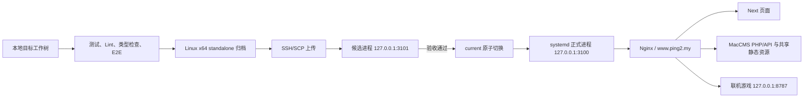

# Next.js 服务器部署手册

最后核验：2026-08-24

本文说明如何把仓库中的 `apps/web/` 部署到当前 Next.js 测试服务器，以及如何验收、更新和回滚。操作以
[`scripts/deploy-next-web.sh`](../scripts/deploy-next-web.sh)、
[`scripts/rollback-next-web.sh`](../scripts/rollback-next-web.sh)、
[`ops/systemd/squaredmedia-next.service`](../ops/systemd/squaredmedia-next.service) 和
[`ops/nginx/www.ping2.my.conf`](../ops/nginx/www.ping2.my.conf) 为事实来源。

## 1. 使用范围与成功标准

当前脚本锁定以下部署边界，环境变量不能把它改成其他域名或目录：

| 项目           | 当前值                                                                |
| -------------- | --------------------------------------------------------------------- |
| 对外地址       | `https://www.ping2.my/`                                               |
| 远端发布根     | `/www/wwwroot/squaredMediaOnline`                                     |
| 正式 Node 监听 | `127.0.0.1:3100`                                                      |
| 候选版本监听   | `127.0.0.1:3101`                                                      |
| systemd 服务   | `squaredmedia-next.service`                                           |
| Nginx 扩展配置 | `/www/server/panel/vhost/nginx/extension/www.ping2.my/react-spa.conf` |
| MacCMS 根目录  | `/www/wwwroot/squaredMedia`                                           |

这是一条独立的 Next.js staging 发布链：

- 会部署 Next.js standalone、React 联机游戏桥接脚本、Nginx include 和 systemd unit。
- 不会部署 MacCMS 主题、`pingfangapi`、`pingfangdevice`、VodOps、数据库或联机游戏服务。
- 不会把本机 macOS 的 `.next` 目录直接当成 Linux 运行产物上传。
- 不会切换主站 `ping2video.xyz`。若要部署其他域名或生产站，必须先同步修改部署脚本、回滚脚本、Nginx、systemd 和相应测试，不能只改环境变量。

本次目标从旧域名和旧发布根迁移后，`/www/wwwroot/squaredMediaOnline` 会形成一条新的
release 链。脚本不会复制或删除旧根 `/www/wwwroot/react_squared_media`，也不会移除
旧 `react.ping2.my` vhost；这些旧资源在确认新域名稳定、回滚边界和保留期限前应保持
原状。

一次发布只有同时满足以下条件才算成功：

1. 本地完整发布门禁通过，且门禁期间构建输入没有变化。
2. Linux x86_64/glibc standalone 归档通过摘要、结构、平台和原生依赖校验。
3. 远端 `3101` 候选进程的健康、页面、静态资源和 404 检查通过。
4. `current` 原子切换后，`squaredmedia-next.service` 在 `3100` 返回本次 release ID。
5. Nginx 配置检查和 reload 通过，测试域页面、旧地址、真实 API、线路质量和 WebSocket 探针通过。
6. 操作人保存本次 release ID、上一版本 ID、部署结果和回滚命令。

## 2. 部署结构



Nginx 继续把 `/index.php`、`/api.php`、`/upload`、`/static` 和 `/template` 交给现有 MacCMS；其余干净页面 URL 才反向代理到 Next。`3100` 和 `3101` 都只监听回环地址，不应放行到公网。

## 3. 一次性准备新服务器

已经能运行 `www.ping2.my` 的服务器可跳到“4. 本地发布环境准备”。全新或重置后的服务器必须先完成本节；部署脚本会创建版本目录，但不会安装操作系统软件、创建宝塔站点、签发证书或安装 MacCMS/API。

### 3.1 服务器基础条件

目标服务器必须满足：

- Linux `x86_64`，使用 glibc。
- `/usr/bin/node` 为 Node.js `22.22.0` 或更高版本。
- 已安装并可直接调用 `curl`、`getconf`、`nginx`、`php`、`runuser`、`sha256sum`、`systemctl`、`tar`、`uname`、`ss` 和 `journalctl`。
- 已存在 `www:www` 用户组；正式 Next 进程以该身份运行。
- 部署账号可以直接写 `/etc/systemd/system/`、宝塔 Nginx 扩展目录和 `/www/wwwroot/`，并能执行 `systemctl`、`nginx -t` 与 Nginx reload。当前脚本不调用 `sudo`，通常应使用专用 root 部署账号或具备等价权限的非交互账号。
- 防火墙只需允许 SSH 和站点的 HTTP/HTTPS；不要开放 `3100`、`3101`。

登录服务器后先检查：

```bash
uname -sm
getconf GNU_LIBC_VERSION
/usr/bin/node --version
id www
command -v curl nginx php runuser sha256sum systemctl tar ss journalctl
nginx -t
```

预期至少看到 `Linux x86_64`、`glibc ...`、Node.js `v22.22.0` 或更高版本，以及有效的 `www` 用户。

### 3.2 站点、证书和 Nginx include

1. 在 DNS 服务商中把 `www.ping2.my` 指向目标服务器。
2. 在宝塔/Nginx 中确认 `www.ping2.my` HTTPS 站点及证书归属；如果该域名已绑定其他站点，先完成备份和迁移确认，不要直接覆盖 vhost。
3. 确认该虚拟主机加载目录
   `/www/server/panel/vhost/nginx/extension/www.ping2.my/` 下的扩展配置。
4. 确认扩展目录已经存在。脚本会替换其中的 `react-spa.conf`，但不会创建缺失的宝塔虚拟主机。
5. 确认从服务器本机以 `www.ping2.my` 作为 Host/SNI 请求时，能够进入正确的虚拟主机，而不是宝塔默认站点或其他既有站点。

可以只读检查 include 是否进入最终 Nginx 配置：

```bash
nginx -T 2>/dev/null | grep -F '/www/server/panel/vhost/nginx/extension/www.ping2.my/'
```

### 3.3 MacCMS 与联机服务依赖

Next 页面仍依赖现有 MacCMS，因此服务器还必须具备：

- `/www/wwwroot/squaredMedia/index.php` 和 `/www/wwwroot/squaredMedia/api.php`。
- 可用的 PHP-FPM socket `/tmp/php-cgi-82.sock`。
- 已安装并验证的 `pingfangapi` 与 `pingfangdevice`。
- `127.0.0.1:8787` 上可用的联机游戏服务；部署探针会验证 `/game-socket` 对错误 Origin 返回 `403`，对合法 Origin 加无效票据返回 `401`。
- MacCMS 的 `/upload`、`/static`、`/template` 资源可由 Nginx 读取。

检查这些依赖：

```bash
test -f /www/wwwroot/squaredMedia/index.php
test -f /www/wwwroot/squaredMedia/api.php
test -S /tmp/php-cgi-82.sock
ss -lnt | grep -E '127\.0\.0\.1:8787|\[::1\]:8787'
```

任一依赖缺失时应先恢复对应服务。`deploy:web` 只发布 Next，不会顺带修复或替换 PHP/API/游戏服务。

## 4. 本地发布环境准备

### 4.1 本机工具

本机需要：

- Node.js `22.22.0` 或更高版本、npm、Bash、`tar`、`shasum`、`file`、SSH 和 SCP。
- 能安装并启动 Playwright Chromium 的桌面或 CI 环境。
- 到目标服务器的 SSH 权限，优先使用专用密钥。
- 足够空间保存 `node_modules/`、`apps/web/.next/` 和 `.cache/next-deploy/v1/` 中的构建缓存。

首次准备依赖和浏览器：

```bash
cd /path/to/SquaredMedia
npm ci
npx playwright install chromium
```

### 4.2 SSH 参数

Next 部署脚本实际读取以下连接参数：

| 变量                   | 是否必需 | 说明                                         |
| ---------------------- | -------- | -------------------------------------------- |
| `DEPLOY_HOST`          | 是       | SSH 主机名或 IP                              |
| `DEPLOY_USER`          | 是       | 具备上述主机级权限的部署账号                 |
| `DEPLOY_PORT`          | 否       | SSH 端口，默认 `22`                          |
| `DEPLOY_IDENTITY_FILE` | 推荐     | 本机私钥的绝对路径                           |
| `DEPLOY_PASSWORD`      | 否       | 仅兼容 `sshpass`；不要写入仓库，优先使用密钥 |

仓库当前用 `scripts/deploy-ping2.env` 统一保存非秘密连接配置。发布前检查该文件指向的确实是目标服务器，但不要把密码、私钥内容或 Token 写入文件。也可以在当前终端临时导出这些变量。

```bash
source scripts/deploy-ping2.env

printf 'host=%s user=%s port=%s\n' "$DEPLOY_HOST" "$DEPLOY_USER" "${DEPLOY_PORT:-22}"
test -f "$DEPLOY_IDENTITY_FILE"
ssh -p "${DEPLOY_PORT:-22}" -i "$DEPLOY_IDENTITY_FILE" \
  -o IdentitiesOnly=yes \
  "$DEPLOY_USER@$DEPLOY_HOST" \
  'uname -sm; /usr/bin/node --version; id www; nginx -t'
```

如果私钥已经由 SSH Agent 或默认 Identity 管理，可以不设置 `DEPLOY_IDENTITY_FILE`，并用等价的 SSH 命令完成连接检查。

不要在 `apps/web/` 下创建 `.env`、`.env.local`、`.env.production` 或
`.env.production.local` 来传部署参数；发布脚本会主动拒绝这些文件。当前 production
build 的同源 API 地址由受控脚本注入，SSH 参数只从当前 shell 环境读取。

### 4.3 发布前 Git 检查

部署脚本按当前工作树的实际内容生成构建指纹，允许发布尚未提交的修改，但操作人必须先确认范围。不要在部署运行期间继续编辑构建输入。

```bash
git branch --show-current
git status --short
git diff --check
git diff --stat
```

至少记录当前分支、提交 ID、未提交文件和预计发布范围：

```bash
git rev-parse HEAD
```

## 5. 首次部署或日常更新

### 5.1 执行命令

在仓库根目录运行：

```bash
source scripts/deploy-ping2.env
npm run deploy:web
```

一般不需要预先单独执行构建。脚本会自动：

1. 获取本地部署锁，计算 Next 发布输入指纹。
2. 执行 `npm ci`、全量测试、Lint、模板/兼容/预览校验、Next 类型检查和 Playwright E2E。
3. 复用相同输入的已验证 Linux 产物，或者重新执行 production build 并组装 Linux x64/glibc 原生依赖。
4. 验证归档摘要、tar 路径、文件类型、standalone 结构、Sharp 版本与 ELF 平台。
5. 通过 SSH/SCP 上传归档、Nginx include 和 systemd unit。
6. 在 `127.0.0.1:3101` 启动候选版本并检查健康、页面、静态 chunk、游戏运行时和真实 404。
7. 保存旧配置，原子更新 `current`，重启 `squaredmedia-next.service`，检查 `3100/healthz`。
8. 执行 `nginx -t` 与 reload，再从服务器回环验证公开页面、旧地址、共享资源、真实 API、线路质量和 WebSocket。
9. 成功后把旧 release 记录为 `previous`，清理本次临时上传，并输出 release ID 与回滚命令。

需要忽略已有产物缓存、强制重新构建时使用：

```bash
source scripts/deploy-ping2.env
NEXT_DEPLOY_FORCE_REBUILD=1 npm run deploy:web
```

这只控制本机 Next Linux 产物缓存，不会清理服务器 release，也不应作为普通失败的首选处理方式。

### 5.2 判断命令是否成功

成功结束时终端会出现类似输出：

```text
Deployed Next.js release <release-id> to https://www.ping2.my/
Previous release: <previous-path-or-none>
Rollback command: NEXT_ROLLBACK_RELEASE=<previous-release-id> npm run rollback:web
Next.js staging deployment completed: <release-id>
```

必须以命令退出码为 `0` 和最后的完成消息为准。候选切换期间短暂的连接重试不等于最终失败；反过来，只看到构建通过、Nginx reload 或单个页面 `200` 也不等于部署完成。

把以下信息保存到发布记录：

- 发布时间、操作人、分支、提交 ID 和未提交修改摘要。
- 新 release ID、上一 release ID、构建输入指纹或缓存命中信息。
- 脚本最终退出码及所有非致命警告。
- 脚本输出的精确回滚命令。
- 后续人工浏览器验收结果。

## 6. 发布后验收

部署脚本已经执行候选和服务器回环 smoke，但仍需从服务器外部与真实浏览器完成验收。

### 6.1 HTTP 与进程检查

在可访问测试域名的机器上执行：

```bash
curl -fsS https://www.ping2.my/healthz
curl -fsSI https://www.ping2.my/
curl -fsSI --max-redirs 0 https://www.ping2.my/games/bamboo-cicada
```

预期：

- `/healthz` 返回 `status=ok`，其中的 `release` 与本次发布 ID 一致。
- 首页返回 `200`。
- `/games/bamboo-cicada` 返回 `308`，`Location` 为 `https://imsai.top/`。

服务器内检查：

```bash
systemctl is-active squaredmedia-next.service
systemctl is-enabled squaredmedia-next.service
systemctl status squaredmedia-next.service --no-pager
journalctl -u squaredmedia-next.service -n 100 --no-pager
readlink -f /www/wwwroot/squaredMediaOnline/current
readlink -f /www/wwwroot/squaredMediaOnline/previous
curl -fsS http://127.0.0.1:3100/healthz
nginx -t
```

公开 TLS 检查应优先不带 `-k`。如果只是为了把已知的域名/证书链问题与应用故障分开，可以临时使用 `curl -k` 验证应用响应，但必须把 TLS 状态单独记录为未通过；不要因一次 Next 发布去修改证书。

### 6.2 浏览器验收

至少检查：

1. 游客：首页、目录、搜索、详情、登录和受限播放状态。
2. 普通会员：登录、历史、收藏、设备、游戏大厅及退出登录。
3. 有权限账号：真实播放、线路切换、试看/付费/密码/版权限制。
4. 游戏：本地单机游戏、五子棋/你画我猜房间连接，以及竹知了官方试玩外链。
5. 视口：桌面、平板和约 `390px` 手机宽度，无横向溢出和不可操作入口。
6. 浏览器网络：没有意外的 `404/5xx`、跨域错误、敏感播放 URL 或 Token 泄漏。

本地 Playwright fixture 和发布脚本 smoke 不能代替真实会员、数据库、CDN、媒体和设备验收。

## 7. 回滚

### 7.1 回滚到脚本输出的指定版本

优先使用发布成功后输出并保存的精确命令：

```bash
source scripts/deploy-ping2.env
NEXT_ROLLBACK_RELEASE=<previous-release-id> npm run rollback:web
```

release ID 格式为：

```text
YYYYMMDDTHHMMSSZ-12位归档摘要
```

回滚脚本会校验目标目录、`release.env`、`release.json`、所有权和写权限，切换 `current`，恢复该版本保存的 Nginx/systemd 配置，并验证健康、首页及真实 `home_v2`、`content` API。任一阶段失败会尝试恢复回滚前的版本和配置。

### 7.2 回滚到 `previous`

没有显式 release ID 时：

```bash
source scripts/deploy-ping2.env
npm run rollback:web
```

该命令只在 `previous` 指向可信且不同于当前版本的 release 时有效。新发布根的首次
部署不会自动把旧 `/www/wwwroot/react_squared_media` release 变成 `previous`，因此
不能假设通用回滚一定可用；发布前应保存原 Nginx 配置、服务状态和站点现状。

### 7.3 回滚边界

`rollback:web` 只回退：

- `/www/wwwroot/squaredMediaOnline/current` 指向的 Next release。
- 对应 release 保存的 Nginx include。
- 对应 release 保存的 systemd unit 和服务状态。

它不会回退 MacCMS 主题、API 插件、设备插件、数据库、Cron 或联机游戏服务。API 与 React 同时修改时，先发布向后兼容 API，再发布 React；发生故障时通常先回滚 Web，再根据依赖关系决定是否单独回滚 API。

## 8. 常见问题

### 8.1 `Next.js source deployment refuses symbolic links`

脚本拒绝 `apps/web` 或 `template/pingfangvideo` 下的符号链接。先确认链接是不是被忽略、可重建的依赖缓存：

```bash
find apps/web template/pingfangvideo \
  \( -path 'apps/web/node_modules' -o -path 'apps/web/.next' \) -prune -o \
  -type l -print
git status --short --ignored apps/web/deploy
```

如果链接来自 `apps/web/deploy/node_modules/.bin`，应在确认没有源码后把整个可重建的 `apps/web/deploy/node_modules` 临时移到仓库外，再重试；不要降低脚本的链接校验，也不要只删除若干 `.bin` 链接。若链接属于源码，先停止发布并核对来源。

### 8.2 `Another local Next.js deployment is already running`

本地锁为 `.cache/next-deploy/v1/.deploy.lock`。先确认没有仍在运行的 `deploy-next-web.sh`、npm、Playwright 或构建进程；只有确认上一次进程已因掉电或 `SIGKILL` 消失后，才能删除这个空锁目录。不要在另一次发布仍运行时清锁。

### 8.3 候选端口 `3101` 已占用

在服务器检查占用者：

```bash
ss -lntp | grep ':3101'
ps -ef | grep '[a]pps/web/server.js'
```

先判断它是仍在运行的部署候选、人工进程还是未知服务。不要直接杀进程；结合部署终端和
`/www/wwwroot/squaredMediaOnline/logs/candidate-<release-id>.log` 确认后再处理。

### 8.4 候选或正式健康检查失败

依次查看：

```bash
journalctl -u squaredmedia-next.service -n 100 --no-pager
ls -lt /www/wwwroot/squaredMediaOnline/logs
curl -v http://127.0.0.1:3100/healthz
nginx -t
```

候选失败发生在流量切换前，通常不会影响当前版本；正式切换后的失败会触发脚本恢复。仍应以脚本最后退出状态和当前 `current`、systemd、Nginx 状态为准。

### 8.5 API smoke 失败

Next 部署会请求真实 `home_v2&compact=1`、目录查询和 `pingfangdevice/sourceQuality`。失败通常意味着 MacCMS、PHP-FPM、API 插件、数据库、地区策略 envelope 或请求预算不符合当前前端契约。不要通过删除 smoke 绕过；先直接检查相同 API 请求和 PHP/Nginx 日志。只有获得 API 发布授权后，才使用独立 API 发布链修复后端。

### 8.6 WebSocket smoke 返回 `404` 或 `502`

检查 `127.0.0.1:8787` 游戏服务、Nginx `/game-socket` location 和允许 Origin。当前预期是错误 Origin 返回 `403`，合法测试域 Origin 加无效票据返回 `401`；`404/502` 表示路由或上游没有正常工作。

### 8.7 SSH 中断或返回 `255`

SSH 中断时远端状态可能未知。重新执行发布前，先检查：

- `current` 与 `previous` 实际指向。
- systemd 服务和 `3100/3101` 监听状态。
- `/tmp/squaredmedia-next.*` 上传文件。
- 本次 release 是否已经存在于 `builds/` 或 `releases/`。
- Nginx include 和 `nginx -t`。

确认状态后再决定继续、回滚或清理，不要盲目重复运行同一个 release。

## 9. 服务器目录与日常运维

| 路径                                                            | 用途                                      |
| --------------------------------------------------------------- | ----------------------------------------- |
| `/www/wwwroot/squaredMediaOnline/releases/<release-id>/`        | 不可变的已发布 Next 版本                  |
| `/www/wwwroot/squaredMediaOnline/current`                       | 当前正式版本符号链接                      |
| `/www/wwwroot/squaredMediaOnline/previous`                      | 上一版本符号链接                          |
| `/www/wwwroot/squaredMediaOnline/config-backups/`               | 部署前 Nginx/systemd 配置备份             |
| `/www/wwwroot/squaredMediaOnline/logs/`                         | 候选进程日志                              |
| `/www/wwwroot/squaredMediaOnline/current/apps/web/.next/cache/` | 唯一由 `www` 写入的 release 缓存目录      |
| `.cache/next-deploy/v1/`                                        | 本机按构建输入保存的已验证 Linux 产物缓存 |

部署脚本没有定义自动清理旧 release 的保留策略。不要删除 `current`、`previous` 指向的目录，也不要在没有备份和明确保留数量时批量清理 `releases/` 或 `config-backups/`。

日常只读状态检查：

```bash
systemctl status squaredmedia-next.service --no-pager
journalctl -u squaredmedia-next.service --since '30 minutes ago' --no-pager
readlink -f /www/wwwroot/squaredMediaOnline/current
curl -fsS http://127.0.0.1:3100/healthz
nginx -t
```

## 10. 操作检查表

### 发布前

- [ ] 已确认目标为 `www.ping2.my`，并核对现有 vhost、证书和站点根不会被误覆盖。
- [ ] 已记录分支、提交、未提交修改和发布范围。
- [ ] SSH 主机、账号、端口和密钥已核对。
- [ ] 服务器为 Linux x86_64/glibc，`/usr/bin/node >= 22.22.0`。
- [ ] Nginx HTTPS 虚拟主机、证书、include 目录和 PHP-FPM 正常。
- [ ] MacCMS、`pingfangapi`、`pingfangdevice` 与 `127.0.0.1:8787` 正常。
- [ ] Playwright Chromium 已安装，部署期间不会继续编辑构建输入。

### 发布后

- [ ] `npm run deploy:web` 退出码为 `0`，已保存 release 与 rollback 命令。
- [ ] systemd active/enabled，`3100/healthz` release 正确。
- [ ] Nginx 配置有效，公开首页和 `/healthz` 正常。
- [ ] 外部 DNS/TLS/CDN 与真实浏览器流程已单独验收。
- [ ] 游客、会员、权限播放、游戏和移动端结果已记录。
- [ ] 若存在失败或警告，已明确当前 `current`、`previous` 和是否需要回滚。
