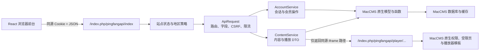

# PingFang API（`pingfangapi`）详细说明

最后核验：2026-07-22

本文描述当前仓库 `addons/pingfangapi/` 的实际实现，供 React 前台开发、
MacCMS 联调、测试和部署使用。代码、插件配置和测试是事实源；本文不把本地
`server/react-api.php` 模拟适配器当作生产接口。

## 1. 定位与边界

`pingfangapi` 是运行在 MacCMS V10 内部的同源 API 适配层。它不替换 MacCMS
后台、会员体系、内容库或播放器，而是把 React 前台所需能力收敛成白名单 JSON
契约，并继续调用 MacCMS 的原生模型、权限和模板逻辑。

React/Next.js 迁移只替换页面渲染和数据传输方式。导航与频道顺序、筛选和分页、
详情信息、播放线路与选集、登录权限、收藏、历史、留言和评论等页面业务语义，都以
原 `template/pingfangvideo` 的可见行为为兼容基准；API 不另行创造一套产品规则。

当前职责包括：

- 首页、导航、目录、筛选、搜索、详情和评论读取。
- 登录、退出和当前会话读取。
- 收藏、播放记录、设备列表和设备撤销。
- 留言、片源报错、评论、顶踩和评分。
- 返回受控的同源播放器 iframe 地址，并在真正加载播放器时再次执行 MacCMS
  原生播放权限校验。

它刻意不做以下事情：

- 不向浏览器返回 `vod_play_url` 或第三方媒体源地址。
- 不开放跨域 API，也不提供公开 CORS 配置。
- 不自行实现会员等级、试看、付费、密码或版权判断。
- 不创建独立业务表，不修改 MacCMS 后台数据结构，不登记运行时 hook。
- 不部署 React 静态文件，也不负责 Nginx 的 SPA 路由切换。

插件元数据版本是 `1.0.0`。`ContentService::CONTENT_CACHE_VERSION = v10` 只是
服务端缓存键版本，不是公开 API 版本号。

## 2. 运行架构



一次 JSON 请求的主要流程是：

1. `Pingfangapi::index()` 检查站点开关和地区访问策略。
2. 控制器加载当前 MacCMS 用户；POST 请求先解析严格 JSON。
3. `ApiRequest` 按 action 校验 Method、查询参数、请求字段、同源、CSRF、登录态
   和频率。
4. `ContentService` 或 `AccountService` 调用 MacCMS 模型、函数和数据库。
5. 控制器统一返回 JSON envelope，并禁止共享 HTTP 缓存。

播放器不是 JSON 响应。浏览器先请求 `action=playback` 取得同源 iframe 路径，
iframe 再进入 `Pingfangapi::player()`，重新执行站点、地区、内容和播放权限判断，
最终渲染 MacCMS 的播放器、试看/付费提示、密码页或版权页。

## 3. 目录结构

| 文件                                                              | 职责                                                         |
| ----------------------------------------------------------------- | ------------------------------------------------------------ |
| `addons/pingfangapi/Pingfangapi.php`                              | 插件主类；安装和卸载不执行 SQL 或 hook 操作                  |
| `addons/pingfangapi/info.ini`                                     | 插件名、版本、说明和后台入口元数据                           |
| `addons/pingfangapi/config.php`                                   | 首页、统计和评论数量的插件配置                               |
| `addons/pingfangapi/application/index/controller/Pingfangapi.php` | 被复制到 MacCMS `application/index/controller/` 的生产控制器 |
| `addons/pingfangapi/service/ApiRequest.php`                       | action 白名单、参数校验、同源/CSRF、限流和响应 envelope      |
| `addons/pingfangapi/service/ContentService.php`                   | 内容查询、权限检查、缓存、DTO 和播放器地址生成               |
| `addons/pingfangapi/service/AccountService.php`                   | 会员、Ulog、评论、留言、互动和设备会话操作                   |
| `addons/pingfangapi/service/ApiException.php`                     | 可映射为 HTTP 状态的业务异常                                 |

## 4. 入口、协议与统一响应

### 4.1 JSON 入口

```text
/index.php/pingfangapi/index?action=<action>
```

当前共有 27 个 action：14 个 GET 和 13 个 POST。action 必须精确匹配白名单；
未知 action 返回 404，Method 不匹配返回 405，并携带 `Allow` 响应头。

### 4.2 播放器 HTML 入口

```text
/index.php/pingfangapi/player/id/<vod_id>/sid/<source_id>/nid/<episode_id>.html
```

该入口返回 HTML，不使用 JSON envelope，也不应被当作公开媒体 URL。正常情况下
前端只使用 `action=playback` 返回的 `url`，不要自行拼接播放器路径。预期调用方法
是 GET；控制器当前没有单独的 Method 白名单，客户端仍不得发送 POST。

`player` 路径中的 `id` 是 API 内部数字 `vod_id`。控制器将它转为整数后直接按
`vod_id` 查询，不会按公开 Vod 路由的 `rewrite.vod_id` 模式解析 `vod_en` 或
`mac_alphaID()`。即使站点对外详情路由使用别名或编码 ID，前端也只能使用
`action=playback` 返回的数字 ID 播放器入口。

### 4.3 成功响应

所有 JSON action 使用相同 envelope：

```json
{
  "code": 1,
  "msg": "内容加载成功",
  "data": {}
}
```

- HTTP 状态为 `200`。
- `code` 固定为 `1`。
- `msg` 是面向用户的中文结果说明。
- `data` 的结构由 action 决定。

### 4.4 失败响应

```json
{
  "code": 422,
  "msg": "score 必须为 1 至 10 的整数",
  "data": null
}
```

失败时 HTTP 状态和 `code` 相同。控制器未捕获的内部异常不会把堆栈或数据库信息
返回浏览器，只记录服务端错误并返回通用 500 信息。

所有 JSON 响应都包含：

```text
Content-Type: application/json; charset=utf-8
X-Content-Type-Options: nosniff
Cache-Control: private, no-store
```

常见 HTTP 状态：

| 状态 | 典型含义                                               |
| ---: | ------------------------------------------------------ |
|  400 | 缺少 action/查询参数、存在未知查询参数或 JSON 语法错误 |
|  401 | 未登录，或原生登录校验失败                             |
|  403 | 同源/CSRF、地区、分类、详情、密码、版权或功能开关拒绝  |
|  404 | action、影片、剧集、评论或设备会话不存在               |
|  405 | action 存在，但 Method 不正确                          |
|  409 | 当前状态冲突，例如重复顶踩/评分或撤销当前设备          |
|  413 | JSON 请求体超过 32 KiB                                 |
|  415 | POST 不是 `application/json`                           |
|  422 | 请求字段类型、长度、范围或组合不合法                   |
|  429 | API 或原生业务限流                                     |
|  500 | 保存失败或未预期的服务端错误                           |
|  503 | 站点维护、依赖服务、缓存/会话、地区或安全能力不可用    |

### 4.5 调用前准备

公开 GET 可以直接请求，但仍建议保留浏览器的同源 Cookie。所有 POST，包括匿名登录、
留言和评论，都必须先在同一 Cookie 会话中取得 CSRF Token：

1. 请求 `GET action=session`，保留响应的 Cookie。
2. 读取响应中的 `data.csrfToken`。
3. POST 时同时发送原 Cookie、`X-CSRF-Token`、
   `X-Requested-With: XMLHttpRequest`、`Content-Type: application/json`。
4. 浏览器会自动发送 `Origin` 或 `Referer`；非浏览器客户端必须显式发送至少一个，
   且协议、主机和端口必须与 API URL 完全一致。
5. 登录和退出都会轮换 Session 与 CSRF。登录后使用响应中的新 Token；退出
   响应不返回 Token，如需继续匿名写入，必须重新请求 `session`。

浏览器初始化示例：

```ts
const API = "/index.php/pingfangapi/index";

const sessionResponse = await fetch(`${API}?action=session`, {
  credentials: "same-origin",
  headers: {
    Accept: "application/json",
    "X-Requested-With": "XMLHttpRequest"
  }
});
const sessionEnvelope = await sessionResponse.json();
if (!sessionResponse.ok || sessionEnvelope.code !== 1) {
  throw new Error(sessionEnvelope.msg || "会话初始化失败");
}
let csrfToken = sessionEnvelope.data.csrfToken;
```

示例中的 `X-Requested-With` 是前端统一请求习惯；GET 本身不需要同源头或 CSRF。

通用 POST 示例：

```ts
async function postAction<T>(action: string, body: unknown): Promise<T> {
  const response = await fetch(`${API}?action=${encodeURIComponent(action)}`, {
    method: "POST",
    credentials: "same-origin",
    headers: {
      Accept: "application/json",
      "Content-Type": "application/json",
      "X-Requested-With": "XMLHttpRequest",
      "X-CSRF-Token": csrfToken
    },
    body: JSON.stringify(body)
  });
  const envelope = await response.json();
  if (!response.ok || envelope.code !== 1) {
    throw new Error(envelope.msg || `请求失败：${response.status}`);
  }
  return envelope.data as T;
}
```

下文的响应示例默认展示完整 envelope。时间字段使用站点 PHP 时区；ID 即使来自
数据库整数，也统一按 JSON 字符串返回。除非接口明确允许，否则多传查询参数或
JSON 字段会被拒绝，而不是被静默忽略。

## 5. Action 总览

### 5.1 GET action

| Action       | 登录 | 主要输入                            | 主要输出                                           |
| ------------ | ---- | ----------------------------------- | -------------------------------------------------- |
| `home`       | 否   | 无                                  | 兼容首页元数据、分类和最多 `home_limit` 个精简影片 |
| `home_v2`    | 否   | 可选 `compact`                      | 当前首页轮播、年度榜、最新和频道区块               |
| `navigation` | 否   | 无                                  | 站点名和当前用户组可见首页频道                     |
| `content`    | 否   | 筛选、搜索、排序、页码和精简选项    | 当前页影片、按需分类总数、剧情筛选和分页元数据     |
| `detail`     | 否   | `vod_id`，可选 `compact`            | 单片完整详情、剧集标识和最多 6 条推荐              |
| `access`     | 否   | 影片、访问范围及可选线路/剧集       | 不含敏感字段的访问状态与提示                       |
| `downloads`  | 否   | `vod_id`                            | 下载线路、条目标识及同源 MacCMS 下载入口           |
| `plot`       | 否   | `vod_id`                            | 影片简介和经清洗的分集剧情                         |
| `playback`   | 否   | `vod_id`、`source_id`、`episode_id` | 同源受控播放器 iframe 描述符                       |
| `session`    | 否   | 无                                  | 登录状态、CSRF、白名单用户资料和表单要求           |
| `comments`   | 否   | `content_id`，可选 `mid`            | 已审核评论列表                                     |
| `favorites`  | 是   | 无                                  | 当前用户最多 100 条收藏                            |
| `history`    | 是   | 可选 `limit`                        | 当前用户最多 100 条播放进度                        |
| `devices`    | 是   | 无                                  | 当前用户的登录设备会话                             |

“无需登录”只表示 action 可匿名调用。具体影片仍会经过当前用户组的分类、详情或
播放权限判断，因此可能返回 403。

### 5.2 POST action

| Action             | 登录 | 请求体                                 | 结果                         |
| ------------------ | ---- | -------------------------------------- | ---------------------------- |
| `login`            | 否   | `username`、`password`、可选 `captcha` | 新登录会话和轮换后的 CSRF    |
| `password.verify`  | 否   | `vodId`、`scope`、`password`           | 建立原生内容密码会话         |
| `logout`           | 是   | 空对象                                 | 撤销当前设备并退出           |
| `favorite`         | 是   | `vodId`、`favorite`                    | 设置或取消收藏               |
| `favorites.delete` | 是   | `all: true` 或 `recordIds`             | 按原生 Ulog 记录批量删除收藏 |
| `history.save`     | 是   | 影片、线路、剧集和进度                 | 保存或更新播放进度           |
| `history.delete`   | 是   | `all: true` 或 `recordIds`             | 按原生 Ulog 记录批量删除进度 |
| `device.revoke`    | 是   | `sessionId`                            | 撤销当前用户拥有的设备会话   |
| `feedback`         | 配置 | `content`，可选 `name`、`captcha`      | 保存 MacCMS 留言             |
| `report`           | 配置 | 原因，可选影片、剧集、详情和验证码     | 保存片源报错留言             |
| `comment`          | 配置 | `vodId`、`content`，可选父评论和验证码 | 保存评论并返回审核状态       |
| `reaction`         | 否   | 目标、目标 ID、`like`/`dislike`/`none` | 顶踩计数                     |
| `rating`           | 否   | `vodId`、1～10 整数评分                | 新平均分和评分数             |

“配置”表示由 MacCMS 后台 `gbook.login` 或 `comment.login` 决定；无论是否登录，
所有 POST 都仍要求同源 Cookie、CSRF Token、JSON 白名单、限流和原生业务校验。

`register`、`registration.code` 和 `recover` 当前不在公开 action 白名单中；请求
任意一项都返回 404。前端不应展示新会员注册或账号找回入口。

## 6. 内容接口详解

### 6.1 `home`：兼容首页

`home` 为旧 React 发布包和回滚保留。它按更新时间读取可播放影片，最多返回
`home_limit` 条；每条影片只保留第一条合法剧集标识，但仍需要读取和解析播放列表。

| 项目       | 值                                             |
| ---------- | ---------------------------------------------- |
| 方法与地址 | `GET /index.php/pingfangapi/index?action=home` |
| 登录       | 不要求；结果仍按当前匿名或会员用户组过滤       |
| 查询参数   | 除 `action=home` 外不接受任何参数              |
| 推荐用途   | 旧发布包兼容、部署 smoke；新首页不要使用       |

完整请求：

```bash
curl -sS 'https://react.example.com/index.php/pingfangapi/index?action=home'
```

成功响应示例：

```json
{
  "code": 1,
  "msg": "首页加载成功",
  "data": {
    "siteName": "平方影视",
    "todayUpdated": 12,
    "hotSearch": ["电影", "电视剧"],
    "categories": [{ "id": "42", "name": "电影" }],
    "videos": [
      {
        "id": "371745",
        "title": "影片名称",
        "category": "电影",
        "remark": "正片",
        "year": "2026",
        "class": "剧情",
        "hits": 100,
        "score": 8.5,
        "updated": "2026-07-22 10:00:00",
        "poster": "/upload/vod/example.jpg",
        "backdrop": "/upload/vod/example-slide.jpg",
        "duration": "120分钟",
        "version": "高清",
        "summary": "影片简介",
        "episodes": [{ "id": "1", "no": 1, "name": "第1集", "sourceId": "1" }]
      }
    ]
  }
}
```

`data` 包含：

- `siteName`：MacCMS 站点名称。
- `todayUpdated`：只统计当前用户组可见、已启用且未进入回收站的当日 Vod；结果按日期和权限摘要缓存 60 秒，不触发 MacCMS 跨内容表的 `mac_data_count()` 聚合。
- `hotSearch`：后台热搜词，去重后最多 20 个。
- `categories`：有内容且当前用户组可见的一级分类。
- `videos`：兼容影片数组，每项含基本卡片字段、摘要和最多一个剧集标识。

当前 React 首页不应继续依赖这个大列表，应使用 `home_v2`。`home` 只为旧客户端和
旧静态发布回滚保留。

主要失败：多传查询参数返回 400；MacCMS 内容、分类权限或播放列表服务不可用时
返回 503；站点、地区或分类访问策略也可能先返回 403/503。

### 6.2 `home_v2`：当前首页

当前 React 使用 `compact=1` 请求有界首页区块：

| 项目       | 值                                                     |
| ---------- | ------------------------------------------------------ |
| 方法与地址 | `GET /index.php/pingfangapi/index?action=home_v2`      |
| 登录       | 不要求；按当前用户组过滤首页频道和影片                 |
| `compact`  | 可选，只接受 `0` 或 `1`；默认 `0`，当前 React 应传 `1` |
| 推荐用途   | 当前首页唯一推荐的数据入口                             |

```text
GET /index.php/pingfangapi/index?action=home_v2&compact=1
```

```json
{
  "code": 1,
  "msg": "首页加载成功",
  "data": {
    "siteName": "平方影视",
    "todayUpdated": 12,
    "categories": [{ "id": "42", "name": "电影" }],
    "hero": [
      {
        "id": "371745",
        "title": "影片名称",
        "year": "2026",
        "class": "剧情",
        "backdrop": "/upload/vod/example-slide.jpg",
        "duration": "120分钟",
        "version": "高清",
        "summary": "影片简介",
        "episodes": [{ "id": "1", "sourceId": "1" }]
      }
    ],
    "ranking": [
      {
        "id": "371745",
        "title": "影片名称",
        "remark": "正片",
        "year": "2026",
        "class": "剧情",
        "score": 8.5,
        "poster": "/upload/vod/example.jpg"
      }
    ],
    "latest": [],
    "latestByCategory": [{ "categoryId": "42", "videos": [] }]
  }
}
```

各区块规则：

| 字段                        | 最大数量 | 查询规则                         | 是否解析剧集               |
| --------------------------- | -------: | -------------------------------- | -------------------------- |
| `hero`                      |        5 | 可见首页频道，按点击量降序       | 是，只提取首个合法剧集标识 |
| `ranking`                   |        5 | 本年度影片，按点击量降序         | 否                         |
| `latest`                    |        6 | 本年度影片，按更新时间降序       | 否                         |
| `latestByCategory[].videos` | 每频道 6 | 本年度、指定频道、按更新时间降序 | 否                         |

首页频道目前由 `HOME_TYPE_IDS = 42,47,48,57,111` 定义。频道不存在，或频道自身
及其后代全部被当前用户组屏蔽时会被跳过。这组 ID 是当前站点数据配置，不是通用
MacCMS 默认值；迁移到新数据库时必须重新核对。

`home_v2` 调用 MacCMS `Vod::listCacheData()`，并把完整的 MacCMS 查询参数传入，
从而复用原生列表权限、排序和缓存行为。Hero 只查询展示、摘要和首集解析所需字段；
普通卡片只查询 `id/title/remark/year/class/score/poster` 对应字段。两类字段投影使用
不同 `pageurl` 缓存命名空间；同时把当前用户组禁用的分类传入 `typenot`，并将权限
摘要写入缓存键，避免不同字段或会员组共用 MacCMS 原生列表缓存。

`compact=1` 还会省略 React 未使用的 `hotSearch`，并把 Hero 的首集描述压缩为
`id/sourceId`。不传 `compact` 时保留旧字段，供旧静态资源和回滚版本兼容使用。

调用建议：先用 `hero[0].episodes[0]` 组合详情或播放路由；卡片只把 `id` 作为影片
标识，不要假定同一影片不会同时出现在多个区块。`latestByCategory` 的顺序与
`categories` 一致，但客户端仍应按 `categoryId` 关联。

主要失败：`compact` 不是 `0/1` 返回 422；多传参数返回 400；MacCMS 原生列表或
分类权限服务不可用返回 503。

### 6.3 `navigation`：轻量导航

| 项目       | 值                                                   |
| ---------- | ---------------------------------------------------- |
| 方法与地址 | `GET /index.php/pingfangapi/index?action=navigation` |
| 登录       | 不要求；按当前用户组过滤                             |
| 查询参数   | 除 `action=navigation` 外不接受任何参数              |
| 推荐用途   | App Shell、页头或非首页路由的轻量导航初始化          |

`navigation` 只返回：

```json
{
  "code": 1,
  "msg": "导航加载成功",
  "data": {
    "siteName": "平方影视",
    "categories": [{ "id": "42", "name": "电影" }]
  }
}
```

它从 MacCMS `type_list` 缓存和当前用户组权限生成频道，不扫描 `vod` 表，适合非
首页路由先绘制站点导航。

分类数组可能为空；客户端应保留首页入口而不是把空数组视为接口失败。多传查询
参数返回 400，分类权限服务不可用返回 503。

### 6.4 `content`：服务端筛选、搜索与分页

| 项目       | 值                                                       |
| ---------- | -------------------------------------------------------- |
| 方法与地址 | `GET /index.php/pingfangapi/index?action=content`        |
| 登录       | 不要求；查询结果按当前用户组过滤                         |
| 限流       | 只有出现 `keyword` 参数时按客户端 IP 限制为每分钟 20 次  |
| 推荐模式   | 新客户端固定 `compact=1`，再按页面需要打开 totals/facets |

请求示例：

```text
GET /index.php/pingfangapi/index?action=content&compact=1&type_id=42&year=2026&sort=latest&page=1&page_size=24&include_facets=1
```

典型组合：

```text
# 全站最新
?action=content&compact=1&page=1&page_size=24&sort=latest

# 与旧首页相同的五个业务频道及其子类
?action=content&compact=1&scope=library&page=1&page_size=24&sort=latest

# 当前年度热度榜，频道范围与首页保持一致
?action=content&compact=1&scope=yearly&year=2026&sort=hot&page=1&page_size=24

# 分类筛选，并返回剧情选项
?action=content&compact=1&type_id=42&class=剧情&page=1&page_size=24&include_facets=1

# 分类索引页，需要每个分类的影片数
?action=content&compact=1&page=1&page_size=1&include_category_totals=1

# 搜索；keyword 必须经过 URL 编码
?action=content&compact=1&keyword=三生&page=1&page_size=24
```

允许的查询参数：

| 参数                      | 规则                     | 默认值或语义                                          |
| ------------------------- | ------------------------ | ----------------------------------------------------- |
| `type_id`                 | 1～2147483647 的正整数   | 不传表示所有可见分类；包含该分类的子类                |
| `area`                    | 最多 40 字符             | 精确匹配 `vod_area`                                   |
| `year`                    | 最多 40 字符             | 精确匹配 `vod_year`                                   |
| `class`                   | 最多 40 字符             | 使用 MacCMS 类别匹配；无原生函数时退化为包含匹配      |
| `lang`                    | 最多 40 字符             | 精确匹配 `vod_lang`                                   |
| `letter`                  | 最多 40 字符             | 精确首字母；`0~9` 展开为数字集合                      |
| `keyword`                 | 最多 100 字符，可为空    | 对片名、演员、导演做前缀匹配；空值明确返回空结果      |
| `scope`                   | `library` 或 `yearly`    | 始终限定到首页五个业务频道及其全部子类                |
| `sort`                    | `latest`、`hot`、`score` | 默认 `latest`                                         |
| `page`                    | 1～100000                | 默认 1                                                |
| `page_size`               | 1～100                   | 默认 24                                               |
| `compact`                 | `0` 或 `1`               | 当前 React 固定传 `1`；不传时保留旧响应契约           |
| `include_category_totals` | `0` 或 `1`               | 设为 `1` 时必须同时 `compact=1`；分类索引页才打开     |
| `include_facets`          | `0` 或 `1`               | 设为 `1` 时必须同时 `compact=1`；需要剧情筛选时才打开 |

关键词中的 `%`、`_` 和反斜杠会被转义为普通字符。搜索形式是 `keyword%`，不是
`%keyword%`；这有利于索引，但不会命中标题中部的任意片段。

`area/year/class/lang/letter` 若出现，trim 后不能为空；这些文本参数和 `keyword`
都拒绝回车、换行或 Tab。显式 `keyword=` 是合法请求，但会明确返回空搜索结果，
并且仍计入搜索限流。

返回结构：

```json
{
  "code": 1,
  "msg": "内容加载成功",
  "data": {
    "siteName": "平方影视",
    "categories": [{ "id": "42", "name": "电影" }],
    "categoryContext": {
      "current": { "id": "4201", "name": "动作", "parentId": "42" },
      "parent": { "id": "42", "name": "电影", "parentId": null },
      "children": [{ "id": "4201", "name": "动作", "parentId": "42" }]
    },
    "facets": {
      "areas": ["中国大陆"],
      "years": ["2026"],
      "langs": ["国语"],
      "classes": ["剧情", "动作"]
    },
    "videos": [
      {
        "id": "371745",
        "title": "影片名称",
        "remark": "正片",
        "year": "2026",
        "class": "剧情",
        "score": 8.5,
        "poster": "/upload/vod/example.jpg"
      }
    ],
    "total": 1000,
    "page": 1,
    "totalPages": 42
  }
}
```

当请求包含 `keyword` 时，`videos[]` 每项还会增加：

```json
{
  "typeName": "电影",
  "actor": "演员甲,演员乙",
  "summary": "最多 200 字的 vod_blurb"
}
```

`categoryContext` 始终存在：未选择分类时三个位置分别为 `null/null/[]`；选择父类时
`current` 是父类且 `parent=null`；选择子类时同时返回直接父类和同一父类下的可见
子类。客户端应使用该结构绘制类型行，不能通过“分类是否出现在一级 categories”
猜测父子关系。

当传入 `include_category_totals=1` 时，`categories[]` 每项增加整数 `total`；未传时
不要依赖该字段。未传 `include_facets=1` 时四个 facet 数组都存在但固定为空数组；
打开后返回当前交叉筛选范围内真实存在的地区、年份、语言和剧情选项。计算
某一维选项时只移除该维本身，保留 `type_id`、`scope`、搜索词及其他已选维度；
例如已选“中国大陆 + 2026”时，年份选项仍受地区条件约束。

精简目录先取当前页 `vod_id`，再只读取卡片需要的 7 个字段：

```text
id, title, remark, year, class, score, poster
```

搜索结果才额外读取并返回 `typeName`、`actor`、`summary`；摘要只来自
`vod_blurb`，不会为列表读取完整 `vod_content`。目录和搜索都不读取播放字段，
也不返回空的 `episodes`。请求页超出实际总页数时，服务端返回最后一页；没有结果
时 `totalPages=0`、`page=1`。

普通精简请求的分类名称直接来自 MacCMS `type_list` 缓存，不执行全站分类
`GROUP BY`。只有 `include_category_totals=1` 才计算并返回 `categories[].total`；只有
`include_facets=1` 才读取四类筛选选项。影片分页总数仍是精确值，并按筛选条件缓存。
`scope=library/yearly` 的范围固定为 `42,47,48,57,111` 及其当前可见子类。
传入 `type_id` 时不会逃离该范围：服务端取“指定分类及其子类”与固定 scope 的
交集，范围外的 `type_id` 返回空结果。`yearly` 不会自行填年份，调用方仍需传入当前
年份和 `sort=hot`。

不传 `compact` 时，接口继续返回 `todayUpdated/contentYear/hotSearch/pageSize`、带
`total` 的分类和旧版完整列表 DTO，供旧前端兼容；新代码不应继续依赖该形状。

主要失败：未知参数返回 400；ID、页码、排序或开关不合法返回 422；未同时设置
`compact=1` 却把 totals/facets 设为 `1` 返回 422（显式设为 `0` 可以不带 compact）；
搜索超限返回 429。无匹配结果不是 404，
而是 `videos=[]`、`total=0`、`totalPages=0`。

### 6.5 `detail`：单片详情

| 项目       | 值                                                |
| ---------- | ------------------------------------------------- |
| 方法与地址 | `GET /index.php/pingfangapi/index?action=detail`  |
| 登录       | 不要求；匿名和会员都执行各自的详情权限            |
| `vod_id`   | 必填，1～2147483647 的影片 ID                     |
| `compact`  | 可选，只接受 `0/1`，默认 `0`；当前 React 应传 `1` |

```text
GET /index.php/pingfangapi/index?action=detail&vod_id=371745&compact=1
```

返回 `siteName`、详情 `video` DTO 和最多 6 条 `related`。详情会执行 MacCMS
`check_user_popedom(..., popedom=2)`，并检查详情版权和内容密码状态。

成功响应示例：

```json
{
  "code": 1,
  "msg": "影片详情加载成功",
  "data": {
    "siteName": "平方影视",
    "video": {
      "id": "371745",
      "typeName": "电影",
      "title": "影片名称",
      "remark": "正片",
      "actor": "演员甲,演员乙",
      "director": "导演甲",
      "year": "2026",
      "area": "中国大陆",
      "class": "剧情",
      "lang": "国语",
      "hits": 100,
      "score": 8.5,
      "updated": "2026-07-22 10:00:00",
      "poster": "/upload/vod/example.jpg",
      "backdrop": "/upload/vod/example-slide.jpg",
      "duration": "120分钟",
      "summary": "影片简介",
      "episodes": [{ "id": "1", "no": 1, "name": "第1集", "sourceId": "1" }],
      "playSources": [
        {
          "id": "1",
          "name": "高清线路",
          "tip": "推荐线路",
          "episodes": [{ "id": "1", "no": 1, "name": "第1集", "sourceId": "1" }]
        }
      ],
      "scoreCount": 25,
      "likes": 21,
      "dislikes": 2
    },
    "related": [
      {
        "id": "371746",
        "title": "相关影片",
        "remark": "正片",
        "year": "2026",
        "class": "剧情",
        "score": 8.2,
        "poster": "/upload/vod/related.jpg"
      }
    ]
  }
}
```

`video.episodes` 是兼容用的扁平剧集数组；`video.playSources` 保留原生线路显示名、
提示和各自剧集，当前页面应优先使用后者。两者都来自 `mac_play_list()` 且不包含
媒体 URL。`scoreCount/likes/dislikes` 分别来自 `vod_score_num/vod_up/vod_down`；
详情 `video.summary` 优先使用 `vod_content`，为空时才回退 `vod_blurb`，并在解码 HTML
实体、移除标签和合并空白后截取最多 180 字符。这与旧 `pingfangvideo` 详情正文优先
语义一致；目录搜索卡片仍使用独立的 `vod_blurb` 最多 200 字符规则。
这里尚未执行 `popedom=3` 的最终播放授权，可播性仍以 `player` 结果为准。`compact=1`
会从主影片中省略 React 未使用的 `typeId`、`letter`、`version`，并且相关推荐只
读取并返回上述 7 字段卡片 DTO，不再携带空剧集、正文、演员、导演、
背景图等详情字段。不传 `compact` 时保留旧版 related 形状。

主要失败：缺少 `vod_id` 返回 400；ID 或 `compact` 格式错误返回 422；影片不存在
返回 404；分类、详情、版权或内容密码拒绝返回 403。`episodes=[]` 表示当前详情没有
可解析剧集，不代表应绕过 API 读取 MacCMS 原始播放字段。

### 6.6 `access`：安全访问状态

`access` 用于详情被 403 拒绝、密码挑战、下载/播放前提示和版权页。它只返回安全的
状态 DTO，不返回密码、用户组规则、原始播放地址或下载地址。

```text
GET /index.php/pingfangapi/index?action=access&vod_id=371745&scope=playback&source_id=1&episode_id=1
```

| 参数                      | 规则                                                                       |
| ------------------------- | -------------------------------------------------------------------------- |
| `vod_id`                  | 必填正整数                                                                 |
| `scope`                   | `detail`、`playback`、`download`、`confirm` 或 `unavailable`               |
| `source_id`、`episode_id` | 可选，但必须成对；`playback/confirm` 验证播放剧集，`download` 验证下载条目 |

```json
{
  "code": 1,
  "msg": "访问状态加载成功",
  "data": {
    "siteName": "平方影视",
    "video": { "id": "371745", "title": "影片名称" },
    "scope": "playback",
    "state": "trial",
    "authorized": true,
    "passwordRequired": false,
    "message": "允许试看",
    "points": 0,
    "tryseeMinutes": 6
  }
}
```

查询字段按 scope 和是否需要剧集定位动态收窄。所有 scope 的基础投影只有
`vod_id,type_id,vod_name,vod_copyright`；原始列表字段只在校验具体条目时短暂读取，
且从不进入 JSON：

| scope                    | 额外权限字段                                                  | 携带成对线路/剧集时                           |
| ------------------------ | ------------------------------------------------------------- | --------------------------------------------- |
| `detail` / `unavailable` | `vod_pwd`                                                     | 不读取播放或下载列表                          |
| `playback` / `confirm`   | `vod_pwd_play`、`vod_points`、`vod_points_play`、`vod_trysee` | 才读取 `vod_play_*`，并共用播放剧集存在性校验 |
| `download`               | `vod_pwd_down`、`vod_points`、`vod_points_down`               | 才读取 `vod_down_*` 并校验下载条目            |

不传 `source_id/episode_id` 时，播放或下载 scope 不会为了只查状态而读取大段
`vod_play_url/vod_down_url`。`confirm` 若携带剧集 ID，与 `playback` 一样在剧集不存在时
返回 404。

`state` 只会是：

| 状态         | 含义                                                       |
| ------------ | ---------------------------------------------------------- |
| `allowed`    | 当前会话允许访问                                           |
| `trial`      | 允许试看，`tryseeMinutes` 是服务端限制分钟数               |
| `password`   | 原生内容密码尚未建立对应 session，需调用 `password.verify` |
| `permission` | 当前用户组无权访问                                         |
| `confirm`    | MacCMS 返回积分/权限确认，`points` 可能大于 0              |
| `copyright`  | 当前 scope 命中 MacCMS 版权状态限制                        |

`authorized=true` 仅代表这个 scope 当前允许继续；播放仍必须请求 `playback` 并让
iframe 再执行原生 `popedom=3`。结果包含会话和用户组判断，统一返回
`Cache-Control: private, no-store`，不能放入 CDN 公共缓存。

### 6.7 `downloads`：下载列表

```text
GET /index.php/pingfangapi/index?action=downloads&vod_id=371745
```

接口使用 `mac_play_list(..., 'down')` 解析 `vod_down_*`，执行下载范围权限与密码
判断，只返回线路名、提示、条目标识及站内 `vod/down` 路径：

```json
{
  "code": 1,
  "msg": "下载列表加载成功",
  "data": {
    "siteName": "平方影视",
    "video": { "id": "371745", "title": "影片名称" },
    "access": {
      "state": "allowed",
      "authorized": true,
      "passwordRequired": false,
      "message": "允许访问",
      "points": 0
    },
    "sources": [
      {
        "id": "1",
        "name": "迅雷下载",
        "tip": "推荐线路",
        "items": [
          {
            "id": "1",
            "name": "第1集",
            "href": "/index.php/vod/down/id/371745/sid/1/nid/1.html"
          }
        ]
      }
    ]
  }
}
```

`href` 必须是当前站点相对路径；绝对地址只有与当前请求协议、主机和端口完全同源
时才会被归一化为相对路径。API 不返回 `vod_down_url` 中的原始资源；点击 `href`
后由 MacCMS 下载控制器再次鉴权。无权限时 `sources=[]`；密码状态会返回条目标识，
前端先验证密码再重新请求。

`href` 是服务端根据当前 MacCMS 公开 Vod 路由模式动态生成的不透明下载入口：

| `rewrite.vod_id` | 路由中的 `id`                                           |
| ---------------- | ------------------------------------------------------- |
| `0`              | 数字 `vod_id`                                           |
| `1`              | `vod_en` 别名                                           |
| `2`              | 使用当前 `encode_len/encode_key` 生成的 `mac_alphaID()` |

因此上面的数字路径只是 `rewrite.vod_id=0` 的示例。前端必须直接使用响应中的
`href`，不能用 `vodId` 自行拼接，也不能假设别名或编码规则不会变。别名模式缺少
`vod_en`、编码模式缺少 `mac_alphaID()`，或最终 URL 不是安全同源地址时返回 503。

### 6.8 `plot`：分集剧情

```text
GET /index.php/pingfangapi/index?action=plot&vod_id=371745
```

接口复用 `mac_plot_list()` 解析 `vod_plot_name/vod_plot_detail`，并将标题、简介和
每条剧情去除 HTML 后返回：

```json
{
  "code": 1,
  "msg": "分集剧情加载成功",
  "data": {
    "siteName": "平方影视",
    "video": { "id": "371745", "title": "影片名称", "summary": "影片简介" },
    "items": [{ "name": "第1集", "detail": "本集剧情概要" }]
  }
}
```

空剧情使用 `items=[]`；影片不存在返回 404，分类权限拒绝返回 403。客户端不得用
本地占位文本伪造剧情条目。

### 6.9 `password.verify`：内容密码

```http
POST /index.php/pingfangapi/index?action=password.verify
Content-Type: application/json
X-CSRF-Token: <session.csrfToken>

{"vodId":"371745","scope":"playback","password":"站点密码"}
```

`scope` 只接受 `detail`、`playback`、`download`，分别建立与 MacCMS 原生
`data-type=1/4/5` 一致的 `1-1-ID`、`1-4-ID`、`1-5-ID` session。接口允许匿名会话，
但仍要求同源、CSRF、每分钟 10 次 API 限流和原生密码时间间隔；密码不会写日志或
返回响应。成功返回：

```json
{
  "code": 1,
  "msg": "密码验证成功",
  "data": { "vodId": "371745", "scope": "playback", "authorized": true }
}
```

成功后重新请求 `detail`、`downloads` 或 `playback`；不要把密码保存到 URL、
localStorage 或 React Query 缓存。错误密码返回 422，过于频繁返回 429。

### 6.10 `playback` 与 `player`

| 项目         | 值                                                   |
| ------------ | ---------------------------------------------------- |
| 方法与地址   | `GET /index.php/pingfangapi/index?action=playback`   |
| 登录         | 不要求；JSON 仅验证剧集入口，iframe 执行最终播放权限 |
| `vod_id`     | 必填，影片 ID                                        |
| `source_id`  | 必填，来自 `detail.video.episodes[].sourceId`        |
| `episode_id` | 必填，来自 `detail.video.episodes[].id`              |

```text
GET /index.php/pingfangapi/index?action=playback&vod_id=371745&source_id=1&episode_id=1
```

JSON 返回示例：

```json
{
  "code": 1,
  "msg": "播放信息加载成功",
  "data": {
    "siteName": "平方影视",
    "vodId": "371745",
    "sourceId": "1",
    "episodeId": "1",
    "title": "影片名称",
    "episodeName": "第1集",
    "poster": "/upload/vod/example.jpg",
    "playSources": [
      {
        "id": "1",
        "name": "高清线路",
        "tip": "推荐线路",
        "episodes": [{ "id": "1", "no": 1, "name": "第1集", "sourceId": "1" }]
      }
    ],
    "kind": "iframe",
    "url": "/index.php/pingfangapi/player/id/371745/sid/1/nid/1.html"
  }
}
```

服务端使用数字 `vod_id` 查询已启用、未回收的影片，解析 `mac_play_list()` 并验证
线路/剧集存在，然后返回 `siteName`、当前剧集描述和不含媒体 URL 的完整
`playSources`，便于播放页保持旧 `pingfangvideo` 的线路/选集切换逻辑。该 JSON action
不叠加详情 `popedom=2`、`vod_pwd` 或详情版权模式；它只会提前拒绝
`vod_copyright=1` 且 `copyright_status=3` 的播放入口。

通过后使用 `url('pingfangapi/player', ... )` 生成路径。若 MacCMS 生成绝对地址，它必须与
当前请求的协议、主机和端口完全同源；协议相对地址和非 HTTP(S) scheme 会被拒绝。
`player` 内部仍把 `id` 当作数字 `vod_id` 直查，不受公开详情/下载路由的
`rewrite.vod_id` 配置影响。

iframe 请求再次执行 `check_user_popedom(..., popedom=3)`、试看、付费、版权状态和
`vod_pwd_play` 会话检查，再通过 `label_vod_play()` 渲染原生模板。React 不应把
`playback.url` 当作 `<video src>`，也不能绕过该入口自行读取播放源。

前端使用：

```tsx
const playback = await contentApi.getPlayback(vodId, sourceId, episodeId);
return <iframe src={playback.url} title={`${playback.title} ${playback.episodeName}`} allowFullScreen />;
```

不要把 `player` URL 永久保存到数据库；每次进入播放页都先请求 `playback`，以便
重新确认剧集是否仍存在，再由 iframe 检查当前会话的播放权限。播放器 URL 返回 HTML，可能是正常播放器、
试看页、付费提示、版权页或密码页，这些都属于 MacCMS 原生业务结果，且受限模板
可能仍以 HTTP 200 返回。资源不存在通常是纯文本 404；地区或依赖异常也返回
HTML/纯文本状态，不使用 JSON envelope。

主要失败：缺少参数返回 400；ID 格式错误返回 422；影片、线路或剧集不存在返回
404；JSON 层命中 `copyright_status=3` 返回 403；生成的播放器 URL 不是安全同源
HTTP(S) 地址时返回 503。详情密码或详情 `popedom=2` 不会让该 JSON 失败；
JSON 成功也不等于最终播放授权成功，最终结果由 iframe 中的原生播放权限决定。

### 6.11 `comments`

| 项目         | 值                                                 |
| ------------ | -------------------------------------------------- |
| 方法与地址   | `GET /index.php/pingfangapi/index?action=comments` |
| 登录         | 不要求；影片详情权限仍会执行                       |
| `content_id` | 必填，影片 ID                                      |
| `mid`        | 可选，默认 `1`；当前仅支持 `1`（影片评论）         |

```text
GET /index.php/pingfangapi/index?action=comments&mid=1&content_id=371745
```

`mid` 省略时默认为 1，当前只支持影片评论模块。服务先验证影片和详情权限；后台
关闭评论时返回空数组。只返回审核通过的评论，按时间倒序，数量由 `comment_limit`
控制。

成功响应：

```json
{
  "code": 1,
  "msg": "评论加载成功",
  "data": {
    "items": [
      {
        "id": "123",
        "parentId": "120",
        "author": "会员",
        "content": "纯文本评论",
        "createdAt": "2026-07-22T10:00:00+08:00",
        "likes": 2,
        "dislikes": 0
      }
    ]
  }
}
```

`content` 会解码 HTML 实体、移除标签、合并空白并截断到 5000 字符。
顶级评论不会返回 `parentId`，客户端应把它视为可选字段。评论关闭时返回成功且
`items=[]`，而不是 403；影片不存在或 `mid` 不受支持时返回 404，影片详情权限拒绝
返回 403，缺少 `content_id` 返回 400。

## 7. 会话与账户接口详解

### 7.1 `session`

任何前端写操作前都应先请求 `session`：

| 项目       | 值                                                |
| ---------- | ------------------------------------------------- |
| 方法与地址 | `GET /index.php/pingfangapi/index?action=session` |
| 登录       | 不要求；匿名与已登录会话都返回 200                |
| 查询参数   | 除 `action=session` 外不接受任何参数              |
| 关键作用   | 初始化 CSRF、恢复登录态、读取登录/留言/评论开关   |

```json
{
  "code": 1,
  "msg": "登录状态加载成功",
  "data": {
    "authenticated": false,
    "csrfToken": "64位十六进制随机值",
    "user": null,
    "requirements": {
      "loginCaptcha": false,
      "feedbackCaptcha": false,
      "feedbackLogin": false,
      "feedbackEnabled": true,
      "feedbackAudit": false,
      "commentCaptcha": false,
      "commentLogin": false,
      "commentEnabled": true,
      "commentAudit": false,
      "captchaUrl": null
    }
  }
}
```

已登录时 `user` 只包含字符串 `id` 和显示名 `name`。不会输出头像、用户组、
积分、邮箱、手机号、密码字段、Cookie 或设备 Token。

`requirements` 来自 MacCMS 后台当前配置：

| 字段              | 来源与前端语义                                             |
| ----------------- | ---------------------------------------------------------- |
| `loginCaptcha`    | `user.login_verify`；登录是否要求图形验证码                |
| `feedbackCaptcha` | `gbook.verify`；留言和片源报错是否要求图形验证码           |
| `feedbackLogin`   | `gbook.login`；留言和片源报错是否必须登录                  |
| `feedbackEnabled` | `gbook.status`；为 `false` 时不应展示可提交的留言/报错表单 |
| `feedbackAudit`   | `gbook.audit`；为 `true` 时成功提交返回 `status=pending`   |
| `commentCaptcha`  | `comment.verify`；评论是否要求图形验证码                   |
| `commentLogin`    | `comment.login`；评论是否必须登录                          |
| `commentEnabled`  | `comment.status`；为 `false` 时不应展示可提交的评论表单    |
| `commentAudit`    | `comment.audit`；为 `true` 时成功提交返回 `status=pending` |
| `captchaUrl`      | 任一验证码开关启用时的同源图形验证码路径，否则为 `null`    |

前端必须同时遵循 enabled、login、captcha 和 audit 四类状态，不能固定把留言、
报错或评论改成会员专属，也不能在后台关闭功能时仍展示可提交表单。

已登录时 `authenticated=true`，并返回：

```json
{ "user": { "id": "12", "name": "会员昵称" } }
```

客户端应在应用启动、页面硬刷新以及收到 401 后调用它。不要把 CSRF Token 存入
长期缓存；它只属于当前 Cookie Session。该 GET 会创建或复用 CSRF Token，因此
会写入当前 PHP Session。设备会话、验证码路由或安全随机数服务不可用时返回 503。

### 7.2 `login`

| 项目       | 值                                               |
| ---------- | ------------------------------------------------ |
| 方法与地址 | `POST /index.php/pingfangapi/index?action=login` |
| 登录       | 不要求                                           |
| CSRF/同源  | 要求，见 4.5；即使登录本身是匿名动作也不能省略   |
| API 限流   | 每个客户端 IP 每分钟 10 次                       |

请求体：

```json
{
  "username": "example-user",
  "password": "example-password",
  "captcha": "可选验证码"
}
```

- `username`：1～100 字符，去除首尾空白。
- `password`：1～200 字符，不自动 trim。
- `captcha`：后台要求时提供，1～100 字符。

浏览器调用：

```ts
const nextSession = await postAction<{
  authenticated: boolean;
  csrfToken: string;
  user: { id: string; name: string } | null;
}>("login", {
  username: "example-user",
  password: "example-password",
  ...(sessionEnvelope.data.requirements.loginCaptcha ? { captcha: captchaValue } : {})
});
csrfToken = nextSession.csrfToken;
```

成功 HTTP 响应示例：

```json
{
  "code": 1,
  "msg": "登录成功",
  "data": {
    "authenticated": true,
    "csrfToken": "轮换后的64位十六进制值",
    "user": { "id": "12", "name": "会员昵称" },
    "requirements": {
      "loginCaptcha": false,
      "feedbackCaptcha": false,
      "feedbackLogin": false,
      "feedbackEnabled": true,
      "feedbackAudit": false,
      "commentCaptcha": false,
      "commentLogin": false,
      "commentEnabled": true,
      "commentAudit": false,
      "captchaUrl": null
    }
  }
}
```

服务调用原生 `User::login()`，强制 `openid=''`、`col=''`，并只在服务端使用
`return_meta` 创建设备会话。设备会话创建失败时会回滚原生登录。成功后 PHP
Session ID 和 CSRF 都会轮换，响应 `data` 是新的 `session` 结构；客户端必须用新
Token 替换旧 Token。

成功响应的 `data` 与 `session` 相同，其中 `authenticated=true`、`user` 非空，并
携带轮换后的 `csrfToken`。用户名、密码或原生验证码校验失败返回 401；请求字段
类型/长度错误返回 422；API 限流返回 429；设备会话创建失败返回 500。客户端不得
根据错误文案区分“用户名不存在”和“密码错误”。

### 7.3 `logout`

| 项目       | 值                                                                |
| ---------- | ----------------------------------------------------------------- |
| 方法与地址 | `POST /index.php/pingfangapi/index?action=logout`                 |
| 登录       | 必须登录                                                          |
| CSRF/同源  | 要求                                                              |
| 请求体     | 推荐空对象 `{}`；真正的空 body 也按空对象处理；任何字段都返回 422 |
| API 限流   | 每个客户端 IP 每分钟 60 次                                        |

请求体推荐发送空对象 `{}`；带 `Content-Type: application/json` 的真正空 body 也会
按空对象处理。服务会尽力撤销当前设备凭证；即使设备表读取或撤销失败，也仍调用
原生 `User::logout()`，随后轮换 Session 和 CSRF。这与旧 `pingfangdevice/logout`
保持一致，避免设备服务异常时用户无法退出。

```json
{
  "code": 1,
  "msg": "已退出登录",
  "data": { "authenticated": false }
}
```

退出响应不会返回新 CSRF。客户端收到成功响应后应清空本地会员数据和旧 Token；
如果匿名状态仍需调用 POST，再请求一次 `session`。未登录返回 401。

## 8. 会员数据接口详解

### 8.1 收藏

#### `favorites`：读取收藏

| 项目       | 值                                                  |
| ---------- | --------------------------------------------------- |
| 方法与地址 | `GET /index.php/pingfangapi/index?action=favorites` |
| 登录       | 必须登录                                            |
| 查询参数   | 除 `action=favorites` 外不接受任何参数              |

`favorites` 从当前用户 `Ulog` 读取：

```text
ulog_mid = 1
ulog_type = 2
```

列表按时间倒序，最多 100 条。影片必须处于启用、未回收状态，并排除当前用户组
分类黑名单；列表读取不会逐片执行详情密码、版权或播放付费检查。详情访问在
`detail` 重新判断，播放权限由 `playback.url` 对应的 iframe `player` 最终判断。

```json
{
  "code": 1,
  "msg": "收藏加载成功",
  "data": {
    "items": [
      {
        "recordIds": ["71"],
        "vodId": "371745",
        "title": "影片名称",
        "poster": "/upload/vod/example.jpg",
        "remark": "已收藏",
        "createdAt": "2026-07-22T10:00:00+08:00"
      }
    ]
  }
}
```

`recordIds` 是该列表项对应的 MacCMS 原生 `ulog_id`，不是影片 ID。收藏项当前每项
包含一个记录 ID；页面删除选中项时必须回传该数组，不能用 `vodId` 代替。
`items=[]` 是正常结果。未登录返回 401；设备会话或分类权限服务不可用返回 503。

#### `favorite`：设置单片收藏状态

| 项目       | 值                                                  |
| ---------- | --------------------------------------------------- |
| 方法与地址 | `POST /index.php/pingfangapi/index?action=favorite` |
| 登录       | 必须登录                                            |
| CSRF/同源  | 要求                                                |
| API 限流   | 每个客户端 IP 每分钟 60 次                          |

设置收藏：

```json
{ "vodId": "371745", "favorite": true }
```

`vodId` 是正整数；`favorite` 必须是真正的 JSON 布尔值，不能传字符串 `"true"`。
`favorite=false` 取消收藏。结果状态是幂等的，但对已收藏影片再次传 `true` 会刷新
收藏时间并把它移到列表前面；取消一个不存在的收藏仍返回成功。

```json
{
  "code": 1,
  "msg": "收藏状态已更新",
  "data": { "vodId": "371745", "favorited": true }
}
```

写入前会执行影片详情权限；影片不存在返回 404，无权访问返回 403，保存失败返回
500。

#### `favorites.delete`：批量删除收藏

| 项目       | 值                                                          |
| ---------- | ----------------------------------------------------------- |
| 方法与地址 | `POST /index.php/pingfangapi/index?action=favorites.delete` |
| 登录       | 必须登录                                                    |
| CSRF/同源  | 要求                                                        |
| API 限流   | 每个客户端 IP 每分钟 60 次                                  |

请求体只能二选一：

```json
{ "recordIds": ["71", "72"] }
```

```json
{ "all": true }
```

`recordIds` 必须是 1～100 个正整数 `ulog_id`，重复 ID 会去重；不能同时提交
`all=true`。`all=false` 本身不代表有效选择，仍必须同时提供 `recordIds`。定向删除
按“当前用户 + `ulog_mid=1` + `ulog_type=2` + 选中 `ulog_id`”执行，不会扩大到同一
影片的其他隐藏记录。

```json
{
  "code": 1,
  "msg": "收藏记录已删除",
  "data": { "removed": 2 }
}
```

目标不存在时仍成功并返回 `removed: 0`。组合错误返回 422，数据库删除失败返回 500。

### 8.2 播放记录

#### `history`：读取播放记录

| 项目       | 值                                                |
| ---------- | ------------------------------------------------- |
| 方法与地址 | `GET /index.php/pingfangapi/index?action=history` |
| 登录       | 必须登录                                          |
| `limit`    | 可选整数，1～100，默认 100                        |

`history` 读取当前用户的播放进度记录：

```text
GET /index.php/pingfangapi/index?action=history&limit=4
```

`limit` 可省略，范围为 1～100，默认 100。首页固定请求 4；完整记录页使用默认值。

```text
ulog_mid = 1
ulog_type = 4
ulog_sid > 0
ulog_nid > 0
```

不按 `ulog_points` 过滤，所以免费、VIP、付费和其他由 MacCMS 产生的 type 4 记录
都能出现在旧播放记录语义中。接口只读取展示字段，不向浏览器暴露积分凭证。

成功响应：

```json
{
  "code": 1,
  "msg": "播放记录加载成功",
  "data": {
    "items": [
      {
        "recordIds": ["81", "82"],
        "vodId": "371745",
        "sourceId": "1",
        "episodeId": "1",
        "title": "影片名称",
        "episodeName": "第1集",
        "poster": "/upload/vod/example.jpg",
        "progress": "第1集 · 已看到 2:05",
        "watchedAt": "2026-07-22T10:00:00+08:00"
      }
    ]
  }
}
```

历史列表按影片折叠为最新一个可用剧集；`recordIds` 收集该折叠项所代表的原生
`ulog_id`。删除这个页面项时应传回整个数组，否则同片的较旧记录可能在下次
请求重新出现。
和收藏列表相同，影片会按启用状态、回收状态和分类黑名单过滤，但列表读取不会替代
后续详情权限和 iframe 播放权限校验。无记录返回 `items=[]`；`limit` 越界返回 422，未登录返回
401。

#### `history.save`：保存播放进度

| 项目       | 值                                                      |
| ---------- | ------------------------------------------------------- |
| 方法与地址 | `POST /index.php/pingfangapi/index?action=history.save` |
| 登录       | 必须登录                                                |
| CSRF/同源  | 要求                                                    |
| API 限流   | 每个客户端 IP 每分钟 60 次                              |

保存进度：

```json
{
  "vodId": "371745",
  "sourceId": "1",
  "episodeId": "1",
  "positionSeconds": 125.8,
  "durationSeconds": 3600
}
```

- 影片必须已启用且未回收，线路和剧集必须能被播放列表解析。
- `positionSeconds` 可为 0；`durationSeconds` 可省略，但提供时至少 1。
- 数值必须有限，服务端向下取整；进度不能大于时长。
- 保存依赖 `ulog_point` 和 `ulog_duration` 两个数据库列。
- 省略 `durationSeconds` 时，更新已有记录会保留旧时长；首次新增记录写入时长 0。

成功响应：

```json
{
  "code": 1,
  "msg": "播放记录已保存",
  "data": { "saved": true }
}
```

服务端按“用户 + 影片 + 线路 + 剧集”更新已有行。更新既有记录时保留
`ulog_points`；只有插入全新进度行才默认写入 `ulog_points=0`，因此不会把已有付费
记录降级或把相同集号的不同线路合并。
影片、线路或剧集不存在返回 404；该 action 不叠加详情 `popedom=2`，最终可播性仍由
iframe `player` 判定。数字类型、范围或进度大于时长返回 422；数据库写入失败返回 500。

历史列表按时间倒序，并按影片保留最新一条有效记录；达到 `limit` 后立即停止。
同一影片的 MacCMS 播放列表在一次请求内最多解析一次。小 `limit` 会限制候选 Ulog
和影片读取数量。

#### `history.delete`：批量删除播放记录

| 项目       | 值                                                        |
| ---------- | --------------------------------------------------------- |
| 方法与地址 | `POST /index.php/pingfangapi/index?action=history.delete` |
| 登录       | 必须登录                                                  |
| CSRF/同源  | 要求                                                      |
| API 限流   | 每个客户端 IP 每分钟 60 次                                |

按原生记录删除：

```json
{ "recordIds": ["81", "82"] }
```

删除全部播放记录：

```json
{ "all": true }
```

选择规则与 `favorites.delete` 相同。定向删除按当前用户、`ulog_mid=1`、`ulog_type=4`
和选中 `ulog_id` 执行；`all=true` 才删除当前用户的全部 type 4 记录。两种方式都不按
积分字段缩窄，也不会因为同一 `vodId` 而扩大删除范围。

```json
{
  "code": 1,
  "msg": "播放记录已删除",
  "data": { "removed": 2 }
}
```

没有匹配记录时返回 `removed: 0`。组合错误返回 422，数据库删除失败返回 500。

### 8.3 设备会话

#### `devices`：读取登录设备

| 项目       | 值                                                |
| ---------- | ------------------------------------------------- |
| 方法与地址 | `GET /index.php/pingfangapi/index?action=devices` |
| 登录       | 必须登录                                          |
| 查询参数   | 除 `action=devices` 外不接受任何参数              |

`devices` 依赖 `pingfangdevice` 的 `DeviceSession` 服务和
`pingfang_device_session` 表。读取前设备服务会把超过有效期的会话标记为过期，
随后返回最多 20 条当前、活动、已撤销或已过期会话，便于与旧设备管理页核对安全
状态：

```json
{
  "code": 1,
  "msg": "登录设备加载成功",
  "data": {
    "maxDevices": 3,
    "items": [
      {
        "sessionId": "12",
        "name": "Mac · Chrome",
        "browser": "Chrome",
        "os": "Mac",
        "loginAt": "2026-07-20 10:00:00",
        "lastActiveAt": "2026-07-22T10:00:00+08:00",
        "ipAddress": "127.0.0.1",
        "userAgent": "Mozilla/5.0 ...",
        "status": "在线",
        "revokedAt": null,
        "current": true
      }
    ]
  }
}
```

`maxDevices` 来自 `pingfangdevice` 当前配置。响应不包含设备 Token、Token 摘要、
登录校验哈希或撤销原因代码；IP、User-Agent 和设备标签均使用设备服务已经转义、
截断的展示值。`revokedAt=null` 表示尚未撤销；客户端只有在 `current=false` 且
`revokedAt=null` 时显示撤销按钮。`status` 保留原生“在线/超限下线/已过期/已下线”
文案。

#### `device.revoke`：撤销设备

| 项目       | 值                                                       |
| ---------- | -------------------------------------------------------- |
| 方法与地址 | `POST /index.php/pingfangapi/index?action=device.revoke` |
| 登录       | 必须登录                                                 |
| CSRF/同源  | 要求                                                     |
| API 限流   | 每个客户端 IP 每分钟 60 次                               |

```json
{ "sessionId": "12" }
```

`sessionId` 必须是当前用户拥有的正整数会话 ID，通常直接来自 `devices.items[]`。

```json
{
  "code": 1,
  "msg": "设备已撤销",
  "data": { "sessionId": "12", "revoked": true }
}
```

不存在或不属于当前用户返回 404；不允许撤销当前设备返回 409；设备服务故障返回
503；其他服务端拒绝映射为 422。对一个已经撤销但仍属于当前用户的会话再次调用
会幂等成功。撤销其他设备不会删除该用户的收藏或历史记录。

## 9. 互动与写入接口详解

### 9.1 `feedback`

| 项目       | 值                                                           |
| ---------- | ------------------------------------------------------------ |
| 方法与地址 | `POST /index.php/pingfangapi/index?action=feedback`          |
| 登录       | 由后台 `gbook.login` 决定                                    |
| CSRF/同源  | 要求                                                         |
| API 限流   | 每个客户端 IP 每分钟 10 次，另受 MacCMS 留言 Cookie 间隔限制 |

```json
{
  "name": "可选显示名",
  "content": "留言正文",
  "captcha": "后台要求时提供"
}
```

`content` 为 1～5000 字符，`name` 最多 100 字符。服务复用 MacCMS 留言开关、
验证码、审核、敏感词过滤和 `gbook_timespan` Cookie 限频。允许匿名时服务端使用
`userId=0`；登录会员的显示名优先来自服务端用户资料，不信任客户端传入的用户 ID。
前端应在渲染前读取 `requirements.feedbackEnabled/feedbackLogin/feedbackCaptcha`；
`feedbackAudit` 用于预期成功响应是 `pending` 还是 `published`。`report` 与留言共用这四项
Gbook 配置。

`name`、`captcha` 省略时使用空值；如果显式提供则不能为空。成功响应：

```json
{
  "code": 1,
  "msg": "留言已提交",
  "data": { "id": "88", "status": "pending" }
}
```

`status` 只会是 `published` 或 `pending`，取决于后台审核配置。留言关闭返回 403；
字段、验证码或原生 Gbook 校验失败返回 422；API 或 Cookie 限频返回 429；过滤、Cookie
或验证码服务不可用返回 503；保存失败返回 500。

### 9.2 `report`

| 项目       | 值                                                   |
| ---------- | ---------------------------------------------------- |
| 方法与地址 | `POST /index.php/pingfangapi/index?action=report`    |
| 登录       | 由后台 `gbook.login` 决定                            |
| CSRF/同源  | 要求                                                 |
| API 限流   | 每个客户端 IP 每分钟 10 次，另受留言 Cookie 间隔限制 |

```json
{
  "vodId": "371745",
  "sourceId": "1",
  "episodeId": "1",
  "reason": "无法播放",
  "details": "可选补充信息",
  "captcha": "后台要求时提供"
}
```

`reason` 为 1～200 字符，`details` 最多 5000 字符。`vodId` 本身可省略，以兼容旧
`book/report` 直接填写描述的页面；此时不得提供线路或剧集。`sourceId` 和
`episodeId` 必须同时提供或同时省略，且提供时必须同时有 `vodId` 并验证具体剧集。
服务只把实际存在的上下文、原因和详情格式化后写入原生 Gbook，不会生成
“影片 ID：0”。

无影片上下文时只传 `reason/details/captcha`；只报告影片时应完全省略 `sourceId`
和 `episodeId`，不要传 `0` 或空字符串。
`details`、`captcha` 若显式提供则必须是字符串；`details` 允许空字符串，`captcha`
不允许空字符串。

```json
{
  "code": 1,
  "msg": "报错已提交",
  "data": { "id": "89", "status": "published" }
}
```

影片或剧集不存在返回 404。只传 `vodId` 时会执行详情权限；传入线路/剧集时执行
剧集存在性校验，不叠加详情 `popedom=2`。参数组合或验证码错误返回 422；
留言关闭返回 403；API/Cookie 限频、依赖错误和保存错误与 `feedback` 相同。

### 9.3 `comment`

| 项目       | 值                                                           |
| ---------- | ------------------------------------------------------------ |
| 方法与地址 | `POST /index.php/pingfangapi/index?action=comment`           |
| 登录       | 由后台 `comment.login` 决定                                  |
| CSRF/同源  | 要求                                                         |
| API 限流   | 每个客户端 IP 每分钟 10 次，另受 MacCMS 评论 Cookie 间隔限制 |

```json
{
  "mid": "1",
  "vodId": "371745",
  "parentId": "123",
  "content": "评论正文",
  "captcha": "后台要求时提供"
}
```

`mid` 默认 1，目前只支持影片；顶级评论应省略 `parentId`，不能传 `0`。回复时
`parentId` 必须是同一影片下已发布评论的正整数 ID。服务验证影片权限、父评论归属、
评论开关、验证码、时间间隔、敏感词和 IP/关键词黑名单。后台开启审核时返回
`status: "pending"`，否则返回 `status: "published"`；已发布回复会尝试调用原生
`Notify::sendReplyNotify()`。
页面应以 `requirements.commentEnabled/commentLogin/commentCaptcha/commentAudit` 决定表单是否展示、
是否需要登录/验证码及提交后的审核提示。

```json
{
  "code": 1,
  "msg": "评论已提交",
  "data": { "id": "123", "status": "pending" }
}
```

`mid` 不为 1 或参数错误返回 422；影片或父评论不存在返回 404；影片权限、评论关闭
或 IP 黑名单返回 403；验证码/关键词规则返回 422；API/Cookie 限频返回 429；
MacCMS 过滤、Cookie 或验证码依赖不可用返回 503；保存失败返回 500。

### 9.4 `reaction`

| 项目       | 值                                                         |
| ---------- | ---------------------------------------------------------- |
| 方法与地址 | `POST /index.php/pingfangapi/index?action=reaction`        |
| 登录       | 不要求                                                     |
| CSRF/同源  | 要求                                                       |
| API 限流   | 每个客户端 IP 每分钟 30 次；写入另有 30 秒目标 Cookie 限制 |

```json
{
  "target": "vod",
  "targetId": "371745",
  "value": "like"
}
```

- `target`：`vod` 或 `comment`。
- `value`：`like`、`dislike` 或 `none`。
- `none` 只读取当前计数，不递增，也不会撤销之前的点赞或点踩。
- 实际写入复用 `vod_up`/`vod_down` 或 `comment_up`/`comment_down`。
- 同一浏览器 30 秒内重复写同一目标会返回 409。

成功响应：

```json
{
  "code": 1,
  "msg": "互动状态已更新",
  "data": {
    "target": "vod",
    "targetId": "371745",
    "value": "like",
    "likes": 21,
    "dislikes": 2
  }
}
```

目标不存在返回 404；影片或评论所属影片无权访问返回 403；枚举或 ID 错误返回 422；
30 秒内重复写入返回 409；每分钟 API 超限返回 429；计数保存失败返回 500。

### 9.5 `rating`

| 项目       | 值                                                         |
| ---------- | ---------------------------------------------------------- |
| 方法与地址 | `POST /index.php/pingfangapi/index?action=rating`          |
| 登录       | 不要求                                                     |
| CSRF/同源  | 要求                                                       |
| API 限流   | 每个客户端 IP 每分钟 10 次；同一影片另有 30 秒 Cookie 限制 |

```json
{
  "vodId": "371745",
  "score": 8
}
```

`score` 必须是 1～10 整数。服务在数据库事务中锁定影片评分行，更新
`vod_score_num`、`vod_score_all` 和一位小数的 `vod_score`，返回本次评分、最新
平均分和总评分数。同一浏览器 30 秒内重复评分同一影片返回 409。

```json
{
  "code": 1,
  "msg": "评分已提交",
  "data": {
    "vodId": "371745",
    "score": 8,
    "average": 8.4,
    "count": 25
  }
}
```

JSON 数值 `8.0` 会按整数 8 接受，但 `8.5`、字符串 `"8"`、0 和 11 都返回 422。
影片不存在返回 404，影片详情权限拒绝返回 403，重复评分返回 409，API 超限返回
429，事务写入失败返回 500。

## 10. DTO 字段参考

### 10.1 详情影片 DTO

当前结构用于 `detail.video`；旧版非 compact 响应还会包含 `typeId`、`letter`、
`version`：

| 字段                            | 类型    | 说明                                                      |
| ------------------------------- | ------- | --------------------------------------------------------- |
| `id`                            | string  | 影片 ID                                                   |
| `typeName`                      | string  | 存在父类时归一到直接父分类的名称                          |
| `title`、`remark`               | string  | 片名和备注                                                |
| `actor`、`director`             | string  | 演员和导演文本                                            |
| `year`、`area`、`class`、`lang` | string  | 内容筛选元数据                                            |
| `hits`                          | integer | 非负点击量                                                |
| `score`                         | number  | 非负评分                                                  |
| `updated`                       | string  | `Y-m-d H:i:s` 更新时间                                    |
| `poster`、`backdrop`            | string  | 经 `mac_url_img()` 处理的图片路径                         |
| `duration`                      | string  | 时长；缺失时使用安全回退文本                              |
| `summary`                       | string  | 优先 `vod_content`，回退 `vod_blurb`；清洗后最多 180 字符 |
| `episodes`                      | array   | 详情包含完整剧集标识                                      |
| `playSources`                   | array   | 线路显示名、提示和分组后的剧集                            |
| `scoreCount`                    | integer | 非负评分人数                                              |
| `likes`、`dislikes`             | integer | 非负顶踩计数                                              |

图片缺失时使用：

```text
/template/pingfangvideo/images/brand/lazyload.png
```

### 10.2 精简内容卡片

`compact=1` 的普通目录和 `detail.related` 只返回：

```text
id, title, remark, year, class, score, poster
```

带 `keyword` 的搜索列表额外返回：

```text
typeName, actor, summary
```

### 10.3 剧集标识

```json
{
  "id": "1",
  "no": 1,
  "name": "第1集",
  "sourceId": "1"
}
```

该结构只用于选择线路和剧集，不含 URL、解析器名或媒体凭证。

### 10.4 首页卡片

`ranking`、`latest` 和频道区块只包含：

```text
id, title, remark, year, class, score, poster
```

轮播卡片包含：

```text
id, title, year, class, backdrop, duration, version, summary, episodes
```

轮播的 `episodes` 只有第一条合法剧集标识；`compact=1` 时每项仅包含 `id` 和
`sourceId`。

### 10.5 `compact=1` 与兼容响应对照

新 React 必须使用 `compact=1`。不传或传 `compact=0` 只用于旧静态资源回滚：

| Action    | `compact=1`                                                                                                                     | `compact=0` 或省略                                                                                                     |
| --------- | ------------------------------------------------------------------------------------------------------------------------------- | ---------------------------------------------------------------------------------------------------------------------- |
| `home_v2` | 无 `hotSearch`；Hero 剧集仅 `id/sourceId`                                                                                       | 根节点增加 `hotSearch`；Hero 剧集增加 `no/name`                                                                        |
| `content` | 根字段为 `siteName/categories/categoryContext/facets/videos/total/page/totalPages`；分类总数和四类 facets 按需；普通卡片 7 字段 | 增加 `todayUpdated/contentYear/hotSearch/pageSize`；分类恒有 `total`；facets 恒计算；影片使用完整 DTO 且 `episodes=[]` |
| `detail`  | 主影片省略 `typeId/letter/version`；保留 `playSources`、互动计数；`related` 为 7 字段卡片                                       | 主影片增加这 3 个字段；`related` 使用完整影片 DTO，`episodes=[]`                                                       |

兼容模式不是更完整的公开 API 版本，不应被新业务继续扩展。部署时 API 与新静态
资源可以同时发布；缓存中的旧静态资源仍能在兼容模式下工作。

## 11. MacCMS 原生逻辑复用

| API 能力      | 复用的 MacCMS 能力                                                              |
| ------------- | ------------------------------------------------------------------------------- |
| 当前用户      | 控制器 `label_user()` 的请求级快照；无快照时回退 `DeviceSession::currentUser()` |
| 登录/退出     | `User::login()`、`User::logout()`                                               |
| 分类          | `Type::getCache('type_list')`、`mac_get_popedom_filter()`                       |
| 首页区块      | `Vod::listCacheData()`                                                          |
| 影片权限      | 控制器 `check_user_popedom()`                                                   |
| 播放/下载列表 | `mac_play_list(..., 'play'/'down')`                                             |
| 分集剧情      | `mac_plot_list()`                                                               |
| 内容密码      | MacCMS `data-type=1/4/5` 对应的原生 Session 键                                  |
| 播放器        | `mac_label_vod_detail()`、`label_vod_play()`、原生 `vod/player*` 和版权模板     |
| 今日更新      | 权限隔离的 Vod 当日范围计数；避免 `mac_data_count()` 冷缓存时汇总多张内容表     |
| 图片          | `mac_url_img()`                                                                 |
| 收藏/历史     | MacCMS `Ulog` 表                                                                |
| 留言/报错     | `Gbook::saveData()`、原生留言配置                                               |
| 评论          | `Comment::saveData()`、`Notify::sendReplyNotify()`、原生审核/黑名单配置         |
| 内容过滤      | `mac_filter_words()`、`captcha_check()`、`mac_get_ip_long()`                    |
| 顶踩/评分     | 原生 Vod/Comment 计数字段和数据库事务                                           |
| 地区策略      | `mainland_ip_limit`、`mac_get_client_ip()`、`IpLocationQuery`                   |

这意味着后台改动会员、验证码、分类权限、评论审核或播放器配置后，API 行为也会
随之变化。React 不应复制一套独立规则。

## 12. 安全模型

### 12.1 同源限制

所有 POST，包括匿名登录、留言和评论，都必须满足：

- `Sec-Fetch-Site` 不能是 `cross-site`。
- `X-Requested-With` 的值应为 `XMLHttpRequest`；服务端 trim 后不区分大小写比较。
- 必须有有效 `Host` 和当前请求协议。
- `Origin` 或 `Referer` 至少存在一个；存在的值必须与当前协议、主机和端口一致。
- 不返回 `Access-Control-Allow-Origin`。

因此 `react.example.com` 不能直接跨域请求 `www.example.com` 的 API。正确部署方式
是在 React 所在主机上把 `/index.php` 等 MacCMS 路径反向代理或同站提供，保持
浏览器视角同源。

### 12.2 CSRF

所有 POST 必须携带 `X-CSRF-Token`，值来自同一 Cookie 会话的 `action=session`
响应。Token 是 32 字节安全随机数的 64 位十六进制表示。

登录和退出都会轮换 PHP Session 与 CSRF。客户端必须：

1. 首次加载先获取 session。
2. 每个 POST 使用当前 Token。
3. 登录成功后保存响应中的新 Token。
4. 退出后丢弃旧 Token，需要继续写入时重新请求 session。

### 12.3 JSON 与字段白名单

- POST 的 `Content-Type` 必须是 `application/json`。
- 请求体上限 32768 字节。
- 空请求体会按空对象处理；非对象 JSON、数组和畸形 JSON 会被拒绝。
- 每个 POST 都拒绝未知 JSON 字段；每个 GET 都拒绝未知查询参数。当前 POST 不检查
  `action` 之外的额外 query，但客户端不得依赖该实现细节。
- ID 必须为正整数，最大 2147483647。JSON body 可传整数或不带前导零的十进制
  字符串；不接受 0、负数、浮点数或 `"0001"`。
- 批量删除最多 100 个原生 Ulog `recordIds`；它们是 `ulog_id`，不是影片 ID。
- 秒数必须使用 JSON number，不能传数字字符串；必须有限且在范围内，浮点数向下
  取整，并拒绝 `NaN`、无穷大和越界值。
- 可选字段不需要时应省略，不要传空字符串或 `null`；客户端不得依赖 PHP `isset`
  对 `null` 的兼容行为。显式字符串会执行对应的最小长度校验，只有明确标注允许
  空字符串的字段例外。

### 12.4 登录和用户隔离

- `user_id` 始终从服务端当前设备会话读取，不接受请求体用户 ID。
- 收藏、历史和设备查询都按当前用户过滤。
- 分类、首页和统计缓存键包含用户组 ID、组类型、分类权限开关和实际禁用分类摘要。
- `home/home_v2/content/favorites/history` 使用启用状态、回收状态和分类黑名单过滤，
  不逐片执行详情密码、版权或播放付费判断；`detail` 单独执行详情权限，
  `playback` 只验证剧集入口不叠加详情权限，iframe `player` 再执行最终播放权限。
  `navigation` 不查询影片，只读取类型缓存并应用频道配置和分类黑名单。
- `comments` 以及以影片为目标的收藏、进度、报错、评论、顶踩和评分写入会先执行
  对应的详情或剧集权限判断。
- 设备 Token、密码、原始播放/下载源、登录校验哈希和撤销原因代码不进入 DTO；
  设备页只返回 `DeviceSession` 已转义、截断的 User-Agent 与 IP 展示值。

### 12.5 频率限制

API 使用“action + 客户端 IP + 当前分钟”的服务端计数：

| Action                          | 每分钟上限 |
| ------------------------------- | ---------: |
| `login`                         |         10 |
| `password.verify`               |         10 |
| 带 `keyword` 的 `content` 搜索  |         20 |
| `feedback`、`report`、`comment` |      各 10 |
| `reaction`                      |         30 |
| `rating`                        |         10 |
| 其他 POST                       |      各 60 |

超限返回 429。评论、留言、顶踩和评分还会继续遵循 MacCMS Cookie 时间间隔和后台
配置，因此通过 API 限流不代表一定能通过原生限频。POST 的 API 限流发生在登录
检查之前，所以匿名失败请求也会消耗该 action 的 IP 限额。`content` 只要出现
`keyword` 参数，即使是 `keyword=`，也会计入搜索限流。

## 13. 缓存与查询策略

### 13.1 服务端内部缓存

| 数据            | 缓存时间                                   | 缓存边界                                                        |
| --------------- | ------------------------------------------ | --------------------------------------------------------------- |
| 兼容 `home`     | `cache_seconds`，默认 300 秒               | `home_limit` + 用户组权限                                       |
| `home_v2`       | `cache_seconds`，默认 300 秒               | compact/legacy + 用户组权限                                     |
| MacCMS 首页列表 | 传入 `Vod::listCacheData()` 的 `cachetime` | 区块 + 字段签名 + 用户组权限摘要，并通过 `typenot` 排除禁用分类 |
| 今日更新        | 最多 60 秒                                 | 日期 + 用户组权限                                               |
| 分类总数        | `summary_cache_seconds`，默认 1800 秒      | 用户组权限                                                      |
| 组合筛选总数    | `summary_cache_seconds`，默认 1800 秒      | 用户组权限 + 筛选条件哈希                                       |
| 地区/年份/语言 | MacCMS 类型或全局扩展配置             | 当前分类                                                      |
| 剧情选项      | `summary_cache_seconds`，默认 1800 秒      | 分类 + 用户组权限 + 当前筛选条件                              |

`cache_seconds=0` 或 `summary_cache_seconds=0` 可关闭相应缓存。内部缓存不会改变
HTTP 的 `private, no-store`，避免带 MacCMS Session Cookie 的响应进入 CDN 共享
缓存。

部署脚本在清理 MacCMS 缓存后会有界请求首页、导航、目录第一页、分类统计和最多
5 个首页频道第一页。服务器回环若命中精确地区策略 403，只完成策略校验，不会把
接口标记为已预热；此时需要从允许地区的客户端重新请求这些公开接口。

### 13.2 目录查询优化

- 首页使用有界区块，不下载 120 条完整影片。
- 首页 Hero 和卡片分别向 `listCacheData()` 传字段白名单，并隔离原生缓存键。
- `navigation` 不扫描影片表。
- 目录先分页 ID，再按 ID 读取字段，保持稳定排序。
- compact 目录读取 7 字段卡片；搜索只增加 3 个渲染字段。
- 目录和推荐不选择 `vod_play_*` 字段、不解析播放列表。
- 普通 compact 目录从类型缓存返回分类名，不触发分类分组统计。
- 地区、年份和语言选项直接复用当前分类或 MacCMS 全局扩展配置，不再为同一组配置值重复扫描影片表。
- 分类数量和剧情选项由调用方显式按需请求。
- 组合筛选仍返回精确总数，并缓存计数结果。
- 跨多分类的精确总数、稳定分页和筛选汇总使用生产库实测更快的主键顺序扫描，避免 MyISAM 大表上的高代价随机读取。
- 分类、地区、年份、语言和字母等选择性筛选不强制排序索引，由数据库按现有单列索引选择执行计划；剧情模糊匹配继续保留顺序索引。
- 搜索使用前缀匹配，且不强制排序索引以避免错误的执行计划假设。

索引策略来自当前生产表的 `SHOW INDEX`、`EXPLAIN` 和只读计时；迁移数据库或改变
表引擎后必须重新验证。复杂搜索仍可能较慢。是否新增索引必须结合生产表引擎和
`EXPLAIN` 决定；MyISAM 上的在线索引变更可能锁表，不应由 API 部署脚本自动执行。

### 13.3 compact 契约体积基线

使用仓库本地适配器同一份 fixture，对比 legacy 与 `compact=1` 的 JSON envelope：

| Action         | 原始 JSON | compact JSON |  降幅 | gzip 降幅 |
| -------------- | --------: | -----------: | ----: | --------: |
| `home_v2`      |    5853 B |       5632 B |  3.8% |      5.9% |
| `content`      |    5189 B |       1879 B | 63.8% |     57.4% |
| 搜索 `content` |    1994 B |       1306 B | 34.5% |     27.5% |
| `detail`       |    1293 B |        799 B | 38.2% |     20.1% |

这些数字只证明字段契约和序列化体积变化，不代表生产数据库 TTFB。生产验收仍需
分别记录冷/热缓存的响应字节、SQL 数、数据库耗时、TTFB 中位数和高分位。

## 14. 插件配置

| 配置项                  | 默认 | 实际允许范围 | 作用                                   |
| ----------------------- | ---: | -----------: | -------------------------------------- |
| `home_limit`            |  120 |      24～300 | 仅限制兼容 `home` 的影片数             |
| `cache_seconds`         |  300 |    0～300 秒 | `home`、`home_v2` 及其原生首页列表缓存 |
| `summary_cache_seconds` | 1800 |  0～86400 秒 | 分类、组合筛选总数和剧情选项缓存       |
| `comment_limit`         |  100 |       1～200 | 单个影片返回的已审核评论上限           |

服务端会再次裁剪配置值，因此后台即使保存越界值，也不会突破上述范围。

## 15. Next.js/React 调用方式

生产构建应使用站内相对路径：

```dotenv
NEXT_PUBLIC_API_BASE_URL=/index.php/pingfangapi/index
NEXT_PUBLIC_HOME_API_URL=/index.php/pingfangapi/index
```

当前 Next.js App Router 仍在客户端边界调用这些 API，以保留 MacCMS Cookie、CSRF 与播放器授权语义：

- `apps/web/src/api/http.ts`：统一 Cookie、超时、错误和 JSON 处理。
- `apps/web/src/api/home.ts`：`navigation`、`home_v2` DTO 校验。
- `apps/web/src/api/content.ts`：目录、详情和播放 DTO 校验。
- `apps/web/src/api/account.ts`：session、CSRF、账户和互动动作。

浏览器请求必须保留同源 Cookie：

```ts
const response = await fetch("/index.php/pingfangapi/index?action=session", {
  credentials: "same-origin",
  headers: {
    Accept: "application/json",
    "X-Requested-With": "XMLHttpRequest"
  }
});

const envelope = await response.json();
const csrfToken = envelope.data.csrfToken;
```

写请求示例：

```ts
await fetch("/index.php/pingfangapi/index?action=favorite", {
  method: "POST",
  credentials: "same-origin",
  headers: {
    Accept: "application/json",
    "Content-Type": "application/json",
    "X-Requested-With": "XMLHttpRequest",
    "X-CSRF-Token": csrfToken
  },
  body: JSON.stringify({ vodId: "371745", favorite: true })
});
```

当前前端默认超时为 10 秒。若生产 API 首次冷查询超过此时间，应优先检查服务端
查询、索引和缓存预热，而不是简单无限延长浏览器超时。

### 15.1 React 方法与生产 action 对照

业务组件应优先调用仓库现有 API 对象，不要在页面中重复拼 URL：

| 生产 action        | React 方法                                           | 说明                                              |
| ------------------ | ---------------------------------------------------- | ------------------------------------------------- |
| `home`             | 无                                                   | 仅部署 smoke 和旧版兼容                           |
| `home_v2`          | `homeApi.getHome()`                                  | 自动发送 `compact=1`                              |
| `navigation`       | `homeApi.getNavigation()`                            | 页头导航                                          |
| `content`          | `contentApi.getContent(query)`                       | 自动发送 `compact=1`，布尔选项映射为 include 参数 |
| `detail`           | `contentApi.getDetail(vodId)`                        | 自动发送 `compact=1`                              |
| `access`           | `contentApi.getAccess(vodId, scope, sid?, nid?)`     | 安全状态，不含播放/下载源                         |
| `downloads`        | `contentApi.getDownloads(vodId)`                     | 返回同源 MacCMS 下载入口                          |
| `plot`             | `contentApi.getPlot(vodId)`                          | 返回清洗后的分集剧情                              |
| `playback`         | `contentApi.getPlayback(vodId, sourceId, episodeId)` | 生产结果必须是同源 iframe                         |
| `session`          | `accountApi.getSession()`                            | 应在应用启动时首先调用                            |
| `comments`         | `accountApi.getComments(vodId, mid?)`                | 生产只支持 `mid=1`                                |
| `favorites`        | `accountApi.getFavorites()`                          | 返回时已解包为数组                                |
| `history`          | `accountApi.getHistory(limit?)`                      | 首页传 4，历史页可省略                            |
| `devices`          | `accountApi.getDevices()`                            | 返回 `{maxDevices, items}`                        |
| `login`            | `accountApi.login(input)`                            | 成功后调用方还需 `adoptSession(result.data)`      |
| `password.verify`  | `accountApi.verifyContentPassword(input)`            | 成功后重新请求受保护内容                          |
| `logout`           | `accountApi.logout()`                                | 成功后立即采用匿名状态并清理私有缓存              |
| `favorite`         | `accountApi.setFavorite(input)`                      | 单片状态更新                                      |
| `favorites.delete` | `accountApi.deleteFavorites(input)`                  | 批量或全部删除                                    |
| `history.save`     | `accountApi.saveHistory(input)`                      | 按线路和剧集保存播放进度                          |
| `history.delete`   | `accountApi.deleteHistory(input)`                    | 与旧播放记录页使用相同删除范围                    |
| `device.revoke`    | `accountApi.revokeDevice(sessionId)`                 | 不允许撤销当前设备                                |
| `feedback`         | `accountApi.submitFeedback(input)`                   | MacCMS 留言                                       |
| `report`           | `accountApi.submitReport(input)`                     | 片源报错                                          |
| `comment`          | `accountApi.submitComment(input)`                    | 发表评论或回复                                    |
| `reaction`         | `accountApi.setReaction(input)`                      | `none` 仅读取计数                                 |
| `rating`           | `accountApi.submitRating(input)`                     | 生产只接受整数评分                                |

`AccountApi` 的写方法返回 `{data, message}` 形式的前端结果包装，而不是原始 HTTP
envelope；页面应显示 `message`，并从 `data` 读取上文列出的业务结果。API 实例只会
维护自己的 CSRF，不会自动更新 React 账户上下文：登录后调用方必须执行
`account.adoptSession(result.data)`。当前 `AccountProvider` 会包装受保护账号请求：
收到 401 时立即切换匿名状态、清理私有查询并由账号页保留 return-to；登录接口自身
的 401 不触发全局退出。退出成功后先采用匿名状态并跳转，再后台刷新 `session`
取得轮换后的 CSRF；刷新失败也不能恢复旧登录态。

### 15.2 生产接口与本地预览适配器的差异

生产契约以 `addons/pingfangapi/service/ApiRequest.php` 为准。`server/react-api.php`
只用于本地页面开发，不能作为安全或权限验收依据。当前需要特别注意：

- 生产业务 ID 必须是 1～2147483647 的正整数；本地 fixture 可能使用 `local-*` 等
  字符串，当前部分 TypeScript schema 也比生产规则宽松。
- 生产评分只能是 1～10 整数；报错的线路和剧集必须成对；批量删除必须在
  `all=true` 与列表 DTO 的原生 `recordIds` 之间二选一。前端类型即使暂未完全收紧，
  也不能传入宽松值。
- 生产 `comments` 只接受 `content_id`；本地适配器可能兼容其他参数名。
- 生产 `playback.kind` 恒为 `iframe`，且 URL 是同源 MacCMS 播放器；本地适配器
  可能返回仅供 fixture 使用的直接媒体地址。
- 生产所有 POST 都校验 Origin/Referer、`X-Requested-With`、CSRF、Cookie 和服务端
  限流；本地成功不能证明这些安全链路通过。
- 生产 `reaction.value=none` 只读取计数；生产重复收藏会刷新收藏时间；退出不会
  删除会员的收藏或历史。不要依赖本地内存状态的不同表现。
- 本地适配器存在不属于生产 27-action 白名单的兼容路由；生产请求必须始终显式
  提供本文列出的 action。

### 15.3 curl 联调

公开 GET：

```bash
curl -sS \
  'https://react.example.com/index.php/pingfangapi/index?action=content&compact=1&page=1&page_size=24'
```

先取得 Cookie 和 CSRF：

```bash
curl -sS \
  -c /tmp/pingfangapi.cookies \
  -H 'X-Requested-With: XMLHttpRequest' \
  'https://react.example.com/index.php/pingfangapi/index?action=session'
```

再把响应中的 `data.csrfToken` 放入写请求：

```bash
curl -sS \
  -b /tmp/pingfangapi.cookies \
  -c /tmp/pingfangapi.cookies \
  -H 'Origin: https://react.example.com' \
  -H 'Referer: https://react.example.com/account' \
  -H 'X-Requested-With: XMLHttpRequest' \
  -H 'X-CSRF-Token: <data.csrfToken>' \
  -H 'Content-Type: application/json' \
  --data '{"username":"example-user","password":"example-password"}' \
  'https://react.example.com/index.php/pingfangapi/index?action=login'
```

不要把真实账号、密码、Cookie 或 CSRF Token 写入仓库、工单或共享日志。登录成功
后响应会包含新 CSRF，后续写请求应使用新值。

## 16. 安装、打包与部署

### 16.1 运行依赖

- 可运行当前站点的 MacCMS V10 和 PHP 环境。
- `pingfangdevice` 插件、`app_begin` hook 和设备会话表。
- MacCMS `ulog` 表中的 `ulog_point`、`ulog_duration` 列。
- 可写的 MacCMS cache/session 目录。
- 地区限制开启时可用的 `IpLocationQuery` 服务。

服务器运行 API 不需要 Node.js；Node 只用于仓库测试、构建、打包和部署脚本。

### 16.2 打包

```bash
npm run package
npm run verify:release
```

生成：

```text
dist/pingfangapi.tar.gz
```

归档包含插件目录和标准 `application/` 控制器载荷。发布校验会检查必需文件、归档
路径、PHP 结构、受控播放器路径和 Ulog 隔离条件。

### 16.3 首次建立后端基线

```bash
source scripts/deploy-ping2.env
DEPLOY_SCOPE=backend npm run deploy
```

`backend` 会安装并验证 `pingfangdevice`、hook、设备表、Ulog 进度列和
`pingfangapi`，但不替换主题。

### 16.4 仅更新 API

```bash
source scripts/deploy-ping2.env
DEPLOY_SCOPE=api npm run deploy
```

API-only 部署会：

1. 在修改前核对现有设备服务、hook 文件摘要、hook 登记、设备表和 Ulog 列。
2. 只上传并替换 `pingfangapi` 插件和应用控制器。
3. 保持主题、React 静态文件和 `pingfangdevice` 不变。
4. 备份旧插件目录和控制器。
5. 检查 PHP 语法并清理配置允许的运行时缓存。
6. 配置站点 Host 时请求兼容 `home` 做真实回环 smoke。

站点启用地区限制且服务器回环恰好被拒绝时，部署只接受精确的 403
`当前地区不可访问` 策略响应；这只能证明控制器和策略生效，不能替代允许地区的
公网验收。

### 16.5 回滚边界

部署事务失败或 smoke 失败时，脚本会自动恢复本次 scope 的文件快照。成功的
API-only 发布会保留类似以下备份：

```text
addons/pingfangapi.backup.<时间戳>
application/index/controller/Pingfangapi.php.backup.<时间戳>
```

当前 `npm run rollback` 只回滚主题，没有成功发布后的 API 自动回滚命令。需要回退
API 时，应在维护窗口核对目标备份后人工恢复插件目录和控制器，并清理 MacCMS
缓存。

## 17. 测试与验收

### 17.1 自动化覆盖

| 测试                                     | 覆盖内容                                                                        | 不覆盖内容                                                 |
| ---------------------------------------- | ------------------------------------------------------------------------------- | ---------------------------------------------------------- |
| `tests/pingfang-api.test.php`            | 生产 action 的核心契约、字段白名单、分页、DTO、同源/CSRF、播放器边界、Ulog 条件 | 不连接真实 MacCMS 数据库，也不保证每个原生模型分支都被执行 |
| `tests/pingfang-api-controller.test.php` | 站点关闭、地区策略、JSON 控制器响应                                             | 不验证真实 GeoIP 数据库                                    |
| `tests/react-api.test.php`               | 本地模拟适配器和 React 约定                                                     | 不能证明生产插件可用                                       |
| `tests/template.test.mjs`                | 插件文件、打包、部署脚本和静态安全断言                                          | 不执行真实登录/付费/播放器                                 |
| React API 单元测试                       | Zod DTO、请求参数、错误和 CSRF 客户端行为                                       | 不替代服务端测试                                           |

常用验证：

```bash
npm test
npm run lint
npm run typecheck:web
npm run build:web
npm run package
npm run verify:release
```

### 17.2 staging 必验矩阵

自动化通过后，至少用独立测试域名验证：

- `navigation` 和 `home_v2&compact=1` 的数量上限、频道 ID、年份区块和图片路径。
- `content&compact=1` 的精简字段、按需分类总数/剧情、跨页去重、越界页、组合筛选和标题前缀搜索。
- `detail&compact=1` 的完整主影片、7 字段推荐和权限结果。
- 真实普通会员的 session、验证码登录、收藏、历史、设备撤销和退出。
- 匿名、普通会员、VIP、试看、付费、详情密码、播放密码和版权影片。
- 评论审核、回复、黑名单、留言/报错、顶踩和评分限频。
- 允许地区与拒绝地区的 JSON 和播放器 HTML 行为。
- API 响应中不存在 `vod_play_url`、设备 Token、密码、Cookie 等敏感字段。

普通会员流程通过不代表 VIP、付费、试看、密码和版权矩阵已经通过；这些场景需要
真实后台配置和对应测试影片。

## 18. 常见问题排查

### 18.1 返回 401 `请先登录`

- 确认请求使用 `credentials: "same-origin"`。
- 检查浏览器是否把 API 请求发到另一个域名或端口。
- 检查 `pingfangdevice` hook 是否已登记、设备 Token 是否撤销或过期。
- 先请求 `session`，不要只依据 React 本地状态判断登录。

### 18.2 POST 返回 403 `CSRF Token 无效`

- 先用同一 Cookie 会话请求 `session`。
- 登录或退出后使用响应中的新 Token。
- 检查请求头名和值，不能把 Token 放在 JSON 请求体代替请求头。

### 18.3 POST 返回 403 `请求来源无效` 或 `拒绝跨源请求`

- 必须有 `X-Requested-With: XMLHttpRequest`。
- 浏览器页面、API 的协议、主机和端口必须一致。
- 反向代理需要正确让应用识别 HTTPS，否则 Origin 是 HTTPS、应用却判断为 HTTP。
- curl 联调必须显式提供正确 Origin 或 Referer。

### 18.4 返回 403 `当前地区不可访问`

这是 MacCMS `mainland_ip_limit` 策略响应。先核对客户端出口 IP、代理头和 GeoIP
服务，不要把所有地区 403 都当作 API action 错误。策略服务异常返回 503。

### 18.5 返回 405

GET action 不能 POST，POST action 不能 GET。读取响应 `Allow` 头确认正确 Method。

### 18.6 返回 415、413 或 422

- 415：POST 没有使用 `application/json`。
- 413：请求体超过 32 KiB。
- 422：字段缺失、类型/范围不正确、存在未知字段或 JSON 顶层不是对象。

### 18.7 首页或目录首次加载慢

依次检查：

1. 区分 `home` 和 `home_v2&compact=1`；当前 React 应使用后者。
2. 检查插件内部缓存和 MacCMS cache 目录可写性。
3. 分别测量分类汇总、筛选总数和当前页 ID 查询，不只看整个请求时间。
4. 对真实 SQL 运行 `EXPLAIN`，核对状态、回收、分类和排序索引。
5. 大型 MyISAM 表新增索引前安排维护窗口，避免在线锁表影响站点。
6. 缓存刚被部署脚本清空时，区分冷请求和稳定的热请求。

### 18.8 `playback` 成功但 iframe 显示受限页

这是允许的两阶段权限结果。`playback` 确认影片和剧集存在并返回受控入口；iframe
还会执行更严格的播放权限、试看、付费、播放密码和版权判断。应检查原生 MacCMS
配置和用户权益，不要改成直接返回媒体 URL。

## 19. 当前已知边界

- API 路径目前没有 `/v1` 版本前缀；本轮以 `compact=1` 保留旧浏览器兼容。后续
  契约变更仍必须同步 PHP、React schema、测试和文档。
- `home` 为兼容回滚保留，响应规模明显大于 `home_v2`。
- 首页频道 ID 是站点专用常量；新数据库不会自动发现业务频道。
- `home_v2` 的年度榜、最新和频道区块只取服务器当前年份，跨年数据不足时不会
  自动回退上一年。
- 收藏、历史和评论目前没有游标或页码；历史可用 `limit` 限制首屏，收藏和评论仍
  分别受 100 和 `comment_limit` 限制。
- 搜索只支持片名、演员和导演的前缀匹配。
- 复杂筛选首次精确计数仍可能扫描大量数据；缓存只能减轻重复请求。
- API 只能同源使用，不适合作为第三方开放 API。
- 评分更新依赖数据库事务和行锁；使用不支持事务或行锁的表引擎时，并发评分的
  原子性不能只由当前 PHP 代码保证。
- 成功部署后的 API 回滚仍需人工选择备份。
- 自动化不能替代真实短信/邮件、VIP、付费、试看、密码、版权和地区策略验收。

## 20. 相关文档

- [MacCMS 插件模块](addons.md)
- [项目总览](overview.md)
- [开发、发布与运维](development-and-operations.md)
- [React 模板迁移矩阵](react-template-migration-matrix.md)
- [React 前台迁移计划](superpowers/plans/2026-07-21-react-frontend-migration.md)
