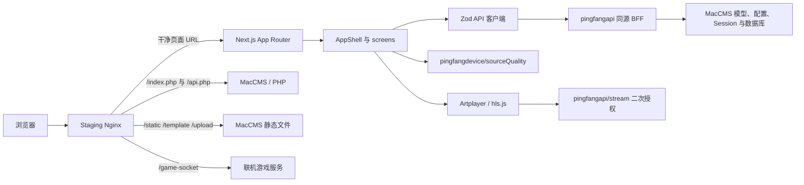
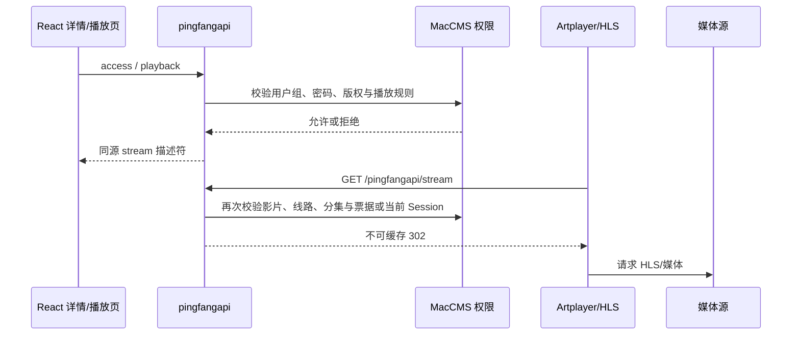

# Next.js 前台

最后核验：2026-07-30

文档状态：当前模块上下文

本文说明 `apps/web/` 在当前工作区中的职责、运行链路、契约边界、构建发布方式和已知限制。生产 API 的逐 action 契约见 [生产 API](pingfangapi.md)，当前分支与未提交迭代见 [工作区快照](knowledge-base/notes/current-worktree-2026-07-30.md)。

## 模块定位

`apps/web/` 是独立的 Next.js 16 App Router 前台。它负责干净 URL、页面与交互状态、运行时数据校验、Artplayer/HLS 播放外壳、六套视觉主题和 staging 发布，不替代 MacCMS：

- MacCMS 继续拥有后台、内容与用户数据、原生 Session、权限规则和生产播放授权。
- `addons/pingfangapi/` 是浏览器与 MacCMS 之间的同源 BFF；React 不直接连接数据库，也不直接调用任意 MacCMS OpenAPI。
- `addons/pingfangdevice/` 提供设备会话、动态筛选、服务端线路抽样和联机游戏票据。
- `server/react-api.php` 只为本地 fixture 验收服务，不能证明生产数据、Cookie、权限或媒体链。
- 当前独立发布目标是 `www.ping2.my` staging；是否已在某次发布中成功运行，必须以对应 release、健康检查和浏览器验收记录为准。

## 技术与源码结构

当前主要依赖为：

- Next.js 16.2.10、React 19.2.7、TypeScript 6.0。
- TanStack Query 5.101.3、React Hook Form 7.82、Zod 4.4.3。
- Artplayer 5.4.0、hls.js 1.6.16。
- Vitest、Testing Library 和 Playwright。

主要目录：

| 路径                                     | 职责                                                  |
| ---------------------------------------- | ----------------------------------------------------- |
| `src/app/**/page.tsx`                    | 显式 App Router 页面入口；保持薄层，只选择对应 screen |
| `src/app/AppShell.tsx`                   | Session-first 全局壳、导航数据和页面挂载门            |
| `src/screens/`                           | 页面组合、请求状态和业务交互                          |
| `src/components/`                        | 导航、播放器、内容边界、线路质量和通用视图组件        |
| `src/api/`                               | 同源 API 客户端、Zod DTO 和错误分类                   |
| `src/server/`                            | 仅 Next Node runtime 使用的 staging 原生播放桥        |
| `src/migrationRoutes.ts`、`src/proxy.ts` | 旧 URL 的 `301`、参数归一化和退场地址 `410`           |
| `src/styles/index.css`                   | React 入口样式，并复用 MacCMS 主题 CSS                |
| `e2e/`                                   | 路由、会话、账号流程和响应式浏览器验收                |
| `deploy/`                                | Linux standalone 中原生依赖使用的独立 lockfile        |

## 运行架构



页面层不拥有内容、订单或权限真相。BFF 负责聚合、字段裁剪、鉴权适配和稳定 DTO；MacCMS 模型与配置仍是业务事实源。

## 页面与路由面

当前工作区有 34 个 `page.tsx`：

| 页面族     | 路由                                                                                       | 数量 |
| ---------- | ------------------------------------------------------------------------------------------ | ---: |
| 发现与目录 | `/`、`/videos`、`/categories`、`/category/[typeId]`、`/search`、`/rankings/yearly`         |    6 |
| 内容与播放 | `/vod/[vodId]` 下的详情、确认、密码、下载、剧情和不可用状态，以及 `/watch/**`、`/trial/**` |   11 |
| 账号与历史 | `/login`、`/account`、收藏、账号历史、设备、匿名 `/history`                                |    6 |
| 互动与状态 | 评论、留言、报错、状态页                                                                   |    4 |
| 会员游戏   | 大厅、2048、俄罗斯方块、竹知了、五子棋、你画我猜                                           |    6 |
| 沉浸式页面 | 七夕粒子玫瑰                                                                               |    1 |

另有：

- `src/app/not-found.tsx`：框架未匹配路由的真实 HTTP `404`。
- `src/app/healthz/route.ts`：Next release 健康与版本响应。
- 两个 `/api/native-playback-*` Route Handler：仅用于当前 staging 的原生媒体兼容桥。

[React 模板迁移矩阵](react-template-migration-matrix.md) 中的“33 个 React 页面”是 86 个 MacCMS 模板的归属统计，不等同于当前文件系统的 34 个 `page.tsx`，两种口径不能混用。

## 渲染与首屏边界

`AppShell` 先读取 Session，等待期间只输出站点壳和“正在确认登录状态”；会话确认后才挂载页面 children。首页请求 `home_v2`，其他页面先请求轻量 `navigation`，默认 `staleTime` 为 5 分钟。

当前 `build:web` 在 Next build 后执行 `verify:web-prerender`。该校验确认：

- 预渲染 HTML 不包含全页 CSR bailout。
- 静态路由保留 `react-app`、站点头部和 Session-first 状态。
- 旧的根级加载占位没有重新进入产物。

它不证明影片、分类或账号数据已由服务器渲染进 HTML。当前公开内容仍在 Session 确认后由客户端请求，因此：

- 不能把“存在静态 HTML 壳”表述成“内容 SSR 已完成”。
- 未匹配框架路由是真实 `404`；动态影片不存在或无权限目前是页面内 UI，页面 HTTP 状态仍可能是 `200`。
- 当前明确不做 SEO；若商业范围改变，需要重新设计 metadata、真实状态码、canonical、站点地图和抓取策略。

## API 契约与状态管理

### 请求约定

`src/api/http.ts` 统一：

- 使用 `credentials: "same-origin"`。
- 默认发送 `Accept: application/json` 和 `X-Requested-With: XMLHttpRequest`。
- 默认 10 秒超时，并区分配置、HTTP、业务、校验、超时、取消和网络错误。
- 只接受站内相对 API 地址；不能把绝对或协议相对地址配置成浏览器 API 基址。

API DTO 在进入页面状态前经过 Zod 校验。React Query 对 4xx、业务、校验和配置错误不做无意义重试；网络、超时和 5xx 才允许有限重试。

### 生产与本地 API

| 运行环境     | 入口                                               | 能证明什么                                         | 不能证明什么                               |
| ------------ | -------------------------------------------------- | -------------------------------------------------- | ------------------------------------------ |
| 生产/staging | `/index.php/pingfangapi/index?action=...`          | 当前生产契约、同源请求形状和 MacCMS 适配代码       | 某台服务器已安装、真实数据和权限矩阵已通过 |
| 本地开发     | `/react-api.php` rewrite 到 `server/react-api.php` | 前端 DTO、错误态、Session/CSRF 交互和 fixture 流程 | 生产模型、Cookie、中间件、线路和媒体授权   |

生产 BFF 当前有 28 个 JSON action：15 个 GET、13 个 POST；另有 `player` 与 `stream` 两个播放入口。所有 POST 统一经过同源、CSRF 和限流检查。详细字段、分页和错误码以 [生产 API](pingfangapi.md) 为准。

### 数据归属

- 匿名观看历史保存在经过校验的浏览器存储中。
- 登录账号的收藏与历史使用 MacCMS `Ulog`；历史写入携带单调 checkpoint，但当前防旧写水位仍存于 PHP Session，不是跨设备共享水位。
- 设备列表和撤销依赖 `pingfang_device_session`。
- 线路偏好和短期健康排序保存在当前浏览器/标签页，不是全局用户画像。
- 首页、目录摘要和统计使用服务端有界缓存；站点专用首页频道仍固定为 `42,47,48,57,111`。

## 内容、权限与播放

### 内容暴露原则

`home`、`home_v2`、`content` 和 `detail` 都使用白名单 DTO，不把原始 `vod_play_url` 或下载源交给列表/详情页。页面按需请求：

- `access`：详情、播放、下载、密码、版权和用户组状态。
- `downloads`：授权后的同源下载入口。
- `plot`：净化和整理后的剧情数据。
- `playback`：与影片、线路和分集绑定的播放描述符。

### React 播放链



MacCMS cache 可用且写入回读成功时，生产流票据由 32 字节随机值生成，十六进制长度 64，默认 120 秒，并绑定影片、线路、分集和媒体授权。cache 不可用或写入失败时，BFF 保留无票据的同源兼容路径，`stream` 重新按当前 Session 执行播放权限；这条回退不支持依赖无 Cookie 接管的场景。短票据可减少原始地址暴露，但不能代替 DRM、版权台账或完整的商业权益系统。

详情页的 `sourceQuality` 是服务器到播放源的短时抽样。它最多检测 12 条线路，带有总预算、重定向、字节和 SSRF 约束，返回健康排序而不返回 URL。播放器另在当前标签页记录首帧、卡顿、失败、实际档位和带宽估计，用于同集换线排序；记录 30 分钟后过期、不含媒体 URL，也不会上传为经营数据。

### Staging 原生播放桥

当前 `/api/native-playback-ticket` 与 `/api/native-playback-stream/[ticket]` 是为 `www.ping2.my` 和特定原生媒体兼容场景增加的隔离桥：

- Host 和 Origin 硬编码为 `www.ping2.my`。
- 只接受既有 `pingfangapi/stream/id/.../sid/.../nid/...` 路径。
- 通过服务器回环把 Cookie 与客户端 IP 交回 PHP 再授权。
- 只有 PHP 返回 `302` 才生成 120 秒票据。
- 票据只存在单个 Node 进程内存中，最多 5000 条；重启或切换 release 会全部失效。

它不是通用生产组件，也不能在多实例间共享。生产 API 若已直接提供服务端票据，React 不应再套这一层。

### 当前播放缺口

- React 生产 `stream` 不能安全地把 `302` 直链限制为试看时长，因此试看路由当前不是完整的服务端安全试看。
- `ps=1` 第三方解析线路不由当前非 iframe React 播放链承载，会返回不可用状态。
- “确认购买”页面没有对应的订单或扣点 action，不能描述为已完成付费闭环。
- VIP、付费、试看、内容密码、版权、地区、浏览器与真实媒体源组合尚未形成完整生产验收矩阵。
- 当前只有标签页内的客户端 QoE 选线优化，没有服务端上报、长期聚合或经营分析链。

## 主题与游戏

React `SiteHeader` 当前注册并管理六套主题：

1. 液态影院。
2. 极光夜幕。
3. 海报画廊。
4. 敦煌流光。
5. 数码粒子。
6. 像素蛙。

React 复用 `template/pingfangvideo/css/style.css`、品牌和游戏资源，但不加载旧主题 `app.js`。主题恢复发生在首帧前，像素主题动效遵循 `prefers-reduced-motion`。

游戏大厅要求登录后展示；2048、俄罗斯方块、五子棋和你画我猜只在登录分支创建隔离 iframe。竹知了主按钮直接在新窗口打开作者官方站 `https://imsai.top/`，`/games/bamboo-cicada` 仅作为 `308` 兼容跳转，不加载本地游戏运行时，也不复制或部署 `imsai-sh/zhuzhiliao` 源码和素材。五子棋与你画我猜先从 `pingfangdevice` 获取 60 秒、游戏和 `client_id` 绑定的 HMAC 票据，再连接同源 `/game-socket`。房间、票据防重放和战局仅存在单个游戏进程内存中；服务重启会结束房间，当前不能直接做多实例水平扩容。`/qixi` 在独立沉浸式 iframe 中复用主题粒子玫瑰，离开路由即销毁动画和监听器。

## 本地开发、构建与发布

常用命令：

```bash
npm run dev:local
npm run test:web
npm run typecheck:web
npm run test:e2e
npm run build:web
npm run analyze:web
npm run performance:lighthouse
```

- `dev:local` 在 `5173` 启动 Next，在 `8084` 启动 PHP fixture，并通过 development rewrites 保持浏览器同源。
- `build:web` 生成 server-capable standalone，再验证 Session-first 静态壳；项目不是静态导出。
- `analyze:web` 生成 Next bundle 分析结果并复用预渲染校验。
- Lighthouse 使用固定本地 fixture，对首页、目录和详情各运行 5 次。当前 performance score、LCP、TBT、CLS 是警告，只有脚本 330 KB 与样式 65 KB 预算是硬失败。
- `deploy:web` 走独立 staging 链，在本机构建 Linux x64/glibc 产物，远端候选端口为 `3101`，通过后原子切换 `3100`。
- `rollback:web` 只回退 Next release、Nginx include 和 systemd 状态，不回退 MacCMS、API、设备表或游戏服务。

完整的服务器准备、发布、验收、回滚和排障步骤见
[Next.js 服务器部署手册](next-server-deployment.md)；命令职责和证据含义见
[开发、发布与数据运维](development-and-operations.md)。

## 验证层级

| 验证                         | 覆盖                                          | 不覆盖                                          |
| ---------------------------- | --------------------------------------------- | ----------------------------------------------- |
| Vitest                       | API schema、组件、路由适配和交互状态          | 浏览器、Nginx、真实 PHP/DB                      |
| PHP API 测试                 | BFF 参数、权限分支、字段隔离和控制器 envelope | 真实 MacCMS autoload、数据库、Cookie 和生产配置 |
| Playwright                   | 本地干净 URL、`301/410`、账号流程和响应式边界 | 生产 Nginx、CDN、真实会员与媒体                 |
| Next build + prerender check | standalone 可构建、静态壳无全页 bailout       | 内容 SSR、真实 API 可用性                       |
| Lighthouse fixture           | 固定样例下的前端体积和实验室指标              | 真实内容图片、网络、CDN 与用户 QoE              |
| staging release smoke        | 候选进程、Nginx 路由、部分真实 API 与静态资源 | 全量会员、付费、试看、地区和媒体矩阵            |

## 已知边界与后续修改路由

- API 没有 `/v1` 版本前缀；契约变更必须同步 PHP、Zod、测试和文档。
- 动态业务 `404/403` 仍需服务端化，不能只依靠客户端状态组件。
- `favorite.status` 已存在于 `ApiRequest`，但生产控制器的安全日志 action 白名单遗漏该值；失败日志会归类为 `unknown`，属于可观测性缺口。
- Figma 基线仍以旧 MacCMS source roots 为事实源，尚未纳入当前 `apps/web`；不能把旧 Final QA 当成 React 设计覆盖证明。
- 修改页面或 DTO：同步 screen、API schema、单元测试和必要 E2E。
- 修改播放：同时审查 `ContentService` 权限/票据、`MacCmsPlayer`、Nginx、真实媒体与回滚路径。
- 修改游戏：同时审查 PHP 票据、浏览器 `client_id`、Node 验签、Origin、Nginx 和单进程状态。
- 修改发布：保持 Next 与 MacCMS 两条发布/回滚链独立，不以一方成功代替另一方。
