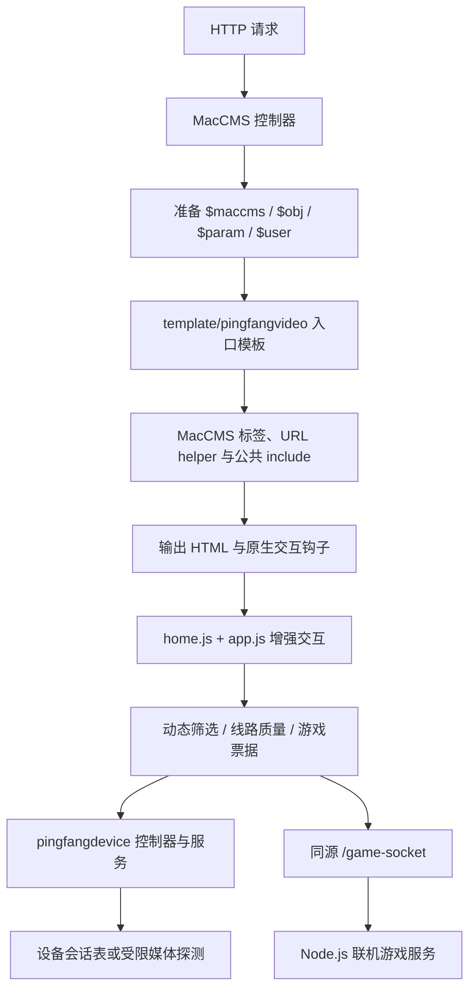
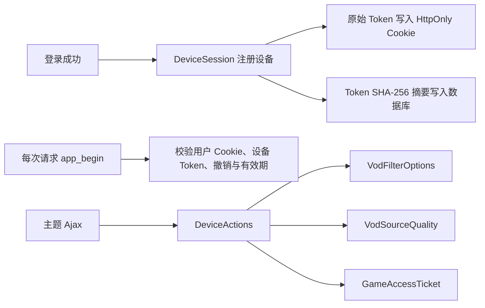
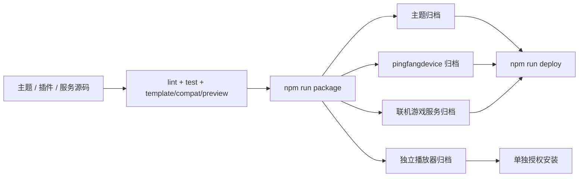

# SquaredMedia 代码逻辑

> [!summary] 当前代码事实
> 本页基于当前工作树中的 `docs/overview.md`、模块上下文文档、`package.json` 和关键入口源码整理。
> 历史 Codex 对话只提供决策背景；当历史内容与本页冲突时，以当前源码和测试为准。

## 项目定位

SquaredMedia 维护 MacCMS V10 视频站主题，以及与主题交付直接相关的插件、预览、独立播放器、联机游戏服务、验证、发布和数据维护工具。仓库不包含完整 MacCMS 核心、生产数据库或完整服务器运行时。

## 模块关系

| 模块 | 当前职责 | 关键入口 | 发布边界 |
| --- | --- | --- | --- |
| `template/pingfangvideo/` | MacCMS 生产主题、模板、共享 CSS/JS、游戏页面 | `html/public/include.html`、`head.html`、`foot.html`、`js/app.js` | 进入主题包 |
| `addons/pingfangdevice/` | 设备会话、动态筛选、线路质量检测、联机游戏短票据 | `controller/DeviceActions.php`、`service/*.php` | 进入插件包并由部署脚本安装 |
| `maccms-player/` | ArtPlayer + hls.js 独立性能播放器 | `static/player/artplayer.html`、`pingfang-player-1.0.0.js` | 独立归档，现有完整部署不安装 |
| `services/game-server/` | 五子棋和你画我猜的票据校验、房间与服务端权威规则 | `index.mjs`、`src/server.mjs`、`src/game-service.mjs` | 独立归档，完整部署会更新服务 |
| `preview/` | 浏览器静态交互预览和样例数据 | `preview/index.html`、`preview/data.json` | 不进入生产包 |
| `server/` | PHP 8.4 本地渲染预览 | `server/index.php`、`lib/data.php`、`lib/render.php` | 不进入生产包 |
| `scripts/`、`tests/` | 校验、打包、部署、回滚、数据维护和回归测试 | `package.json` scripts | 工程支撑 |
| `docs/` | 当前上下文、规范、运维手册和历史决策 | `docs/overview.md` | 不进入生产包 |

## 生产请求链



### 主题共享逻辑

- `include.html` 在样式加载前恢复主题选择，并装载主题 CSS、jQuery、MacCMS 配置和 `home.js`。
- `head.html` 输出头部、搜索、用户状态、主题切换器与移动抽屉，并打开主内容。
- `foot.html` 关闭页面结构并加载 `app.js`。
- `app.js` 负责导航、主题、登录退出反馈、收藏、分页、首页标签、自动下一集、动态筛选、线路质量、继续观看、轮播和条件化 GSAP 动效。
- 生产模板的数据和路由语义来自 MacCMS 标签与 helper；本地预览不能替代真实 MacCMS 验收。

### 插件逻辑



- `DeviceActions` 集中登录、撤销、筛选、线路检测、游戏票据和退出动作，避免两套控制器入口漂移。
- 线路检测只允许受限的公网 HTTP(S) 媒体地址，限制跳转、响应体和总预算，返回健康排序但不返回播放地址。
- 游戏票据是 60 秒、限定单一游戏的 HMAC 票据；Node 服务还校验 Origin 和重复使用。

### 播放与换线逻辑

- MacCMS 生产播放仍由 `{$player_data}` 和 `{$player_js}` 选择播放器。
- 详情页通过 `pingfangdevice/sourceQuality` 获取当前集的线路健康排序，给出唯一推荐入口。
- 独立播放器在启动超时、持续缓冲、致命 HLS 或原生视频错误时，请求主题桥接切换同集候选线路。
- 已尝试线路和播放进度只在当前标签页短期保存，避免换线循环。
- `maccms-player/` 与主题必须作为同一版本组合验收，但播放器包目前需要单独授权安装。

### 联机游戏逻辑

- 已登录主题页向插件申请短票据，再通过同源 WebSocket 子协议连接 `/game-socket`。
- `src/server.mjs` 负责 Origin、票据与 WebSocket 生命周期。
- `GameService` 负责房间、人数、五子棋落子与胜负、你画我猜轮次、绘画权限、答案隔离和限流。
- 房间只存内存；服务重启会结束现有房间。

## 本地预览链

| 链路 | 流程 | 不能证明 |
| --- | --- | --- |
| 静态预览 | `preview/index.html → fetch preview/data.json → 浏览器生成页面` | MacCMS 标签、真实登录、插件端点、生产播放器 |
| PHP 预览 | `server/index.php → data.php → render.php → HTML` | 真实 MacCMS 模板解析与生产数据库 |
| 生产链 | `MacCMS 控制器 → 生产模板 → home.js/app.js` | 仍需线上登录、数据、线路和缓存验收 |

## 验证与发布链



日常主题变更至少执行：

```bash
npm test
npm run lint
npm run lint:template
npm run verify:compat
npm run verify:preview
```

发布前继续执行 `npm run package` 和 `npm run verify:release`。各验证只证明自己的层级；CI 构建归档，不连接生产服务器。

## 修改时的同步规则

| 修改区域 | 必须同步检查 |
| --- | --- |
| 生产模板结构或标签 | MacCMS 官方主题文档、主题规范、模板测试、兼容与预览验证 |
| 共享 CSS/JS 标记 | 生产模板、静态预览、PHP renderer，避免把开发路径带入生产 |
| 插件动作或服务 | 两套控制器入口、服务层、PHP 测试、安装 SQL 与主题端点 |
| 发布包内容 | 打包脚本、发布验证、CI 上传路径和运维文档 |
| 远端安装步骤 | 部署/回滚脚本、备份、失败恢复和静态契约测试 |
| 数据维护行为 | 先补测试与预演路径，再审视备份、写入范围和回滚 |

## 当前边界与待确认

- 当前工作树中的跟踪差异只涉及文档清理；本页没有把历史分支中的 React、旧播放器或未落地插件描述成当前生产能力。
- `docs/superpowers/` 是历史设计与计划，不是当前实现索引。
- SquaredMedia 项目的负责人、优先级、目标日期和真实进度仍需项目负责人补录。
- 生产部署、数据库写入和播放器安装需要单独授权，阅读历史对话不构成再次执行授权。

## 当前事实来源

- [[docs/overview|项目总览]]
- [[docs/theme-and-preview|主题与本地预览]]
- [[docs/addons|MacCMS 插件]]
- [[docs/development-and-operations|开发、发布与数据运维]]
- `package.json`
- `template/pingfangvideo/js/app.js`
- `addons/pingfangdevice/controller/DeviceActions.php`
- `services/game-server/src/server.mjs`
- `services/game-server/src/game-service.mjs`
